## ART GRPO usage in CoDreamer

This project uses the ART library for GRPO-style reinforcement learning updates. We create a `TrainableModel`, register a serverless backend, generate trajectory groups, score them, and call `model.train(...)` with `TrainConfig`.

## RL Pipeline Architecture

The following diagram shows the complete reinforcement learning loop in the `codreamer` backend:

```mermaid
flowchart TD
    Start([API Request: /learn-loop]) --> Init[Initialize Run ID & Results Directory]
    Init --> ResetScores[Reset Node Scores to 1.0]
    ResetScores --> BaseEmail[Generate Baseline Email<br/>Iteration 0]

    BaseEmail --> LoopStart{For each<br/>iteration}

    LoopStart -->|Yes| Step1[Step 1: Generate Trajectories]
    Step1 --> LoadScenarios[Load Synthetic Scenarios<br/>Customer + Product pairs]
    LoadScenarios --> CreateGroups[Create Trajectory Groups<br/>K rollouts per scenario]
    CreateGroups --> Rollout[Rollout Function]

    Rollout --> AgentLoop{Agent Loop<br/>Max Turns}
    AgentLoop --> GetConnected[Tool: get_connected_nodes<br/>Browse KG structure]
    GetConnected --> GetContext[Tool: get_relevant_context<br/>node_id → Extract facts + citations]
    GetContext --> ProposeEmail[Tool: propose_email<br/>Draft subject/body]
    ProposeEmail --> FinalizeEmail[Tool: finalize_email<br/>subject, body, citations]

    FinalizeEmail --> TrajectoryComplete[Trajectory with final_email]

    TrajectoryComplete --> Step2[Step 2: Score Trajectories]
    Step2 --> RULERScore[RULER Judge<br/>LLM evaluates email quality]
    RULERScore --> BlendScore[Blend with online feedback<br/>Email open/reply rates]
    BlendScore --> AssignReward[Assign reward to trajectory]

    AssignReward --> Step3[Step 3: GRPO Update]
    Step3 --> ARTTrain[ART model.train<br/>judged_groups, TrainConfig]
    ARTTrain --> ServerlessBackend[OpenPipe Serverless Backend<br/>Checkpoint + Policy Update]

    ServerlessBackend --> Step4[Step 4: Update KG Weights]
    Step4 --> IdentifyTop[Identify top 50% trajectories<br/>by reward]
    IdentifyTop --> ExtractCitations[Extract node citations<br/>from high-reward emails]
    ExtractCitations --> BoostWeights[Boost node weights<br/>KGScorer.update_from_trajectory]

    BoostWeights --> SaveSnapshot[Save node_scores.json snapshot]
    SaveSnapshot --> GenIterEmail[Generate iteration email<br/>with updated model]
    GenIterEmail --> LogMetrics[Log rewards metrics<br/>mean, median, min, max]
    LogMetrics --> WeaveTrace[W&B Weave trace<br/>Trajectory + Score + Policy]

    WeaveTrace --> NotifyFrontend[Webhook to Frontend<br/>Email + Node Scores]
    NotifyFrontend --> LoopStart

    LoopStart -->|No| FinalAlias[Alias final_email.json<br/>Last iteration email]
    FinalAlias --> End([Return run_id & results_path])

    style Step1 fill:#e3f2fd
    style Step2 fill:#fff3e0
    style Step3 fill:#f3e5f5
    style Step4 fill:#e8f5e9
    style ARTTrain fill:#9c27b0,color:#fff
    style WeaveTrace fill:#6366f1,color:#fff
    style NotifyFrontend fill:#ff5722,color:#fff
```



### Pipeline Steps Explained

1. **Step 1: Generate Trajectories**
   - Load customer scenarios (prospect + goal + seed nodes)
   - For each scenario, create K rollouts (default: 4)
   - Agent uses KG tools to explore graph and draft personalized email
   - Output: `TrajectoryGroup` with `messages_and_choices` + `final_email`

2. **Step 2: Score Trajectories**
   - RULER LLM Judge evaluates email quality (relevance, persuasiveness, coherence)
   - Blend with simulated/real online feedback (open rates, reply rates)
   - Assign `reward` (0-1 scale) to each trajectory

3. **Step 3: GRPO Update**
   - Call `model.train(judged_groups, TrainConfig(learning_rate=...))`
   - ART/OpenPipe serverless backend applies Group Relative Policy Optimization
   - Model learns: "Which KG paths lead to high-reward emails?"

4. **Step 4: Update KG Weights**
   - Extract node citations from top 50% of trajectories
   - Boost `node_scores.json` for cited nodes (weighted by trajectory reward)
   - Future iterations prioritize high-scoring nodes in KG traversal

### Key Files

| File | Purpose |
|------|---------|
| `codreamer/scripts/api.py` | FastAPI endpoint `/learn-loop` |
| `codreamer/scripts/pipeline.py` | 5-step pipeline orchestration |
| `codreamer/training/rollout.py` | Agent rollout with KG tools |
| `codreamer/training/rewards.py` | RULER scoring + reward blending |
| `codreamer/knowledge_graph/kg_scoring.py` | Node weight updates |
| `codreamer/training/model_setup.py` | ART TrainableModel creation |

Features used:
- `TrainableModel` with `ServerlessBackend` registration
- Trajectory types: `Trajectory`, `TrajectoryGroup` for rollouts and batching
- GRPO updates via `model.train(judged_groups, config=TrainConfig(...))`
- Dataset iteration with `art.utils.iterate_dataset`
- Checkpoint management via `model.delete_checkpoints()` in minimal loop
- Inference via model’s OpenAI-compatible endpoint in `rollout`
- Env configuration: `ART_PROJECT`, `ART_MODEL_NAME`, `ART_BASE_MODEL`

### Model creation and registration

```13:23:codreamer/training/model_setup.py
async def create_and_register_model() -> art.TrainableModel:
    load_dotenv()
    random.seed(RANDOM_SEED)
    model = art.TrainableModel(
        name=os.getenv("ART_MODEL_NAME", "model"),
        project=os.getenv("ART_PROJECT", "codreamer"),
        base_model=os.getenv("ART_BASE_MODEL", "Qwen/Qwen2.5-14B-Instruct"),
    )
    backend = ServerlessBackend()
    await model.register(backend)
    return model
```

Environment variables:

- `ART_PROJECT` (default: `codreamer`)
- `ART_MODEL_NAME` (default: `model`)
- `ART_BASE_MODEL` (default: `Qwen/Qwen2.5-14B-Instruct`)

### Trajectory generation and scoring

```39:51:codreamer/scripts/pipeline.py
@weave.op()
async def generate_trajectories(model: art.Model) -> list[art.TrajectoryGroup]:
    scenarios = load_synthetic_scenarios()
    groups: list[art.TrajectoryGroup] = []
    for s in scenarios:
        groups.append(
            art.TrajectoryGroup(
                (rollout(model, ScenarioInput(step=0, scenario=s)) for _ in range(ROLLOUTS_PER_GROUP))
            )
        )
    finished = await art.gather_trajectory_groups(groups, pbar_desc="gather", max_exceptions=ROLLOUTS_PER_GROUP * len(scenarios))
    return finished
```

```54:60:codreamer/scripts/pipeline.py
@weave.op()
async def score_trajectories(groups: list[art.TrajectoryGroup]) -> list[art.TrajectoryGroup]:
    judged: list[art.TrajectoryGroup] = []
    for g in groups:
        judged.append(await score_trajectory_group(g))
    return judged
```

### GRPO update (training)

```63:79:codreamer/scripts/pipeline.py
@weave.op()
async def grpo_update(model: art.TrainableModel, judged_groups: list[art.TrajectoryGroup]) -> None:
    logger.info("[Step 3] GRPO update (ART train)")
    # Retry with simple exponential backoff on transient backend errors
    attempts = 0
    delay = 2.0
    while True:
        try:
            await model.train(judged_groups, config=art.TrainConfig(learning_rate=LEARNING_RATE))
            return
        except Exception as e:
            attempts += 1
            if attempts >= 3:
                raise
            logger.warning(f"[Step 3] Train failed (attempt {attempts}), retrying in {delay:.1f}s: {e}")
            await asyncio.sleep(delay)
            delay *= 2
```

The minimal training loop shows the same pattern end-to-end:

```21:49:codreamer/scripts/train.py
async def _run() -> None:
    load_dotenv()
    weave_project = os.getenv("WEAVE_PROJECT", "pierg-org/codreamer")
    weave.init(weave_project)
    setup_logging()
    model = await create_and_register_model()
    scenarios = load_synthetic_scenarios()
    training_iterator = iterate_dataset(scenarios, groups_per_step=GROUPS_PER_STEP, num_epochs=1, initial_step=await model.get_step())

    async for batch in training_iterator:
        groups: list[art.TrajectoryGroup] = []
        for s in batch.items:
            groups.append(
                art.TrajectoryGroup(
                    (rollout(model, ScenarioInput(step=batch.step, scenario=s)) for _ in range(ROLLOUTS_PER_GROUP))
                )
            )

        finished_groups = await art.gather_trajectory_groups(groups, pbar_desc="gather", max_exceptions=ROLLOUTS_PER_GROUP * len(batch.items))
        judged = [await score_trajectory_group(g) for g in finished_groups]

        await model.delete_checkpoints()
        await model.train(judged, config=art.TrainConfig(learning_rate=LEARNING_RATE))
        logger.info(f"Completed step {batch.step}")
        if batch.step >= MAX_STEPS:
            break
```

### Inference integration

Rollouts run against the registered model’s inference endpoint (e.g., OpenAI-compatible), with trajectories emitted for scoring and training.

```34:41:codreamer/training/rollout.py
async def _openai_client(model: art.Model) -> AsyncOpenAI:
    return AsyncOpenAI(base_url=model.inference_base_url, api_key=model.inference_api_key)

@weave.op()
async def rollout(model: art.Model, scenario_input: ScenarioInput) -> ProjectTrajectory:
    traj = ProjectTrajectory(reward=0.0, messages_and_choices=[], metadata={"step": scenario_input.step, "prospect_id": scenario_input.scenario.prospect.prospect_id})
```

### Notes

- Training uses ART’s GRPO under the hood; `TrainConfig(learning_rate=...)` tunes the optimizer.
- Checkpoints are managed via `ServerlessBackend`; `delete_checkpoints()` clears prior state between steps in the minimal loop.
- Set `WANDB_API_KEY` for authenticated backend logging where applicable.
