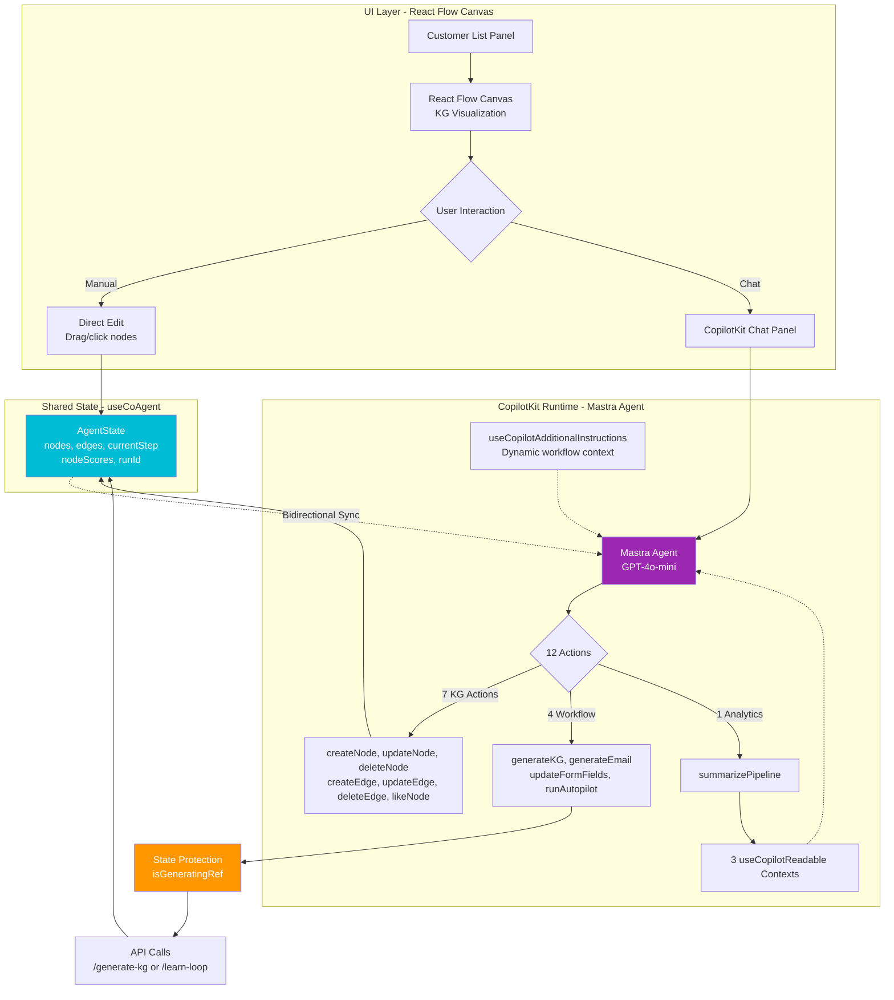

# CopilotKit Integration

## Overview

This project leverages **CopilotKit** as an end-to-end, agentic framework to power a conversational interface for saas email outreach generation.

## Frontend Architecture

The following diagram shows the CopilotKit integration in `codreamer-agui`:



### CopilotKit Integration Points

1. **useCoAgent Hook** - Shared `AgentState` with bidirectional sync between UI and agent
2. **useCopilotAction (12 actions)** - 7 KG editing + 4 workflow automation + 1 analytics
3. **useCopilotReadable (3 contexts)** - Customer list, workflow states, pipeline metrics
4. **useCopilotAdditionalInstructions** - Dynamic workflow context based on current step
5. **State Protection** - `isGeneratingRef` prevents race conditions during async operations

### Key Files

| File | Purpose |
|------|---------|
| `codreamer-agui/src/app/page.tsx` | Main frontend component with CopilotKit hooks |
| `codreamer-agui/src/app/api/agent/route.ts` | Mastra agent API endpoint |

## Key Features Enabled by CopilotKit

### 1. Chat-First Workflow Automation

### 2. Bulk Editing Knowledge Graph through Chat Interface

### 3. Executive Summaries & Analytics

### 4. Dynamic suggestions for each step

## Integration Summary

| CopilotKit Feature                   | Our Implementation                             | Benefit                               |
| ------------------------------------ | ---------------------------------------------- | ------------------------------------- |
| **useCoAgent**                       | Shared `AgentState` with KG nodes/edges        | Real-time UI-agent synchronization    |
| **useCopilotAction**                 | 12 actions (KG editing + workflow + analytics) | Chat-controllable workflow automation |
| **useCopilotReadable**               | Customer pipeline + workflow states            | Agent has full context for insights   |
| **useCopilotAdditionalInstructions** | Dynamic workflow context                       | Agent adapts to current step          |
| **Mastra Agent**                     | GPT-4o-mini with working memory                | Stateful agent with 12-action toolkit |
| **Dynamic Suggestions**              | Step-specific onboarding prompts               | Self-guided user experience           |
| **State Protection**                 | Race condition prevention                      | Data integrity during generation      |

## Technical Architecture

### Mastra + CopilotKit Integration

```
┌─────────────────────────────────────────────────────────┐
│                    CopilotKit Runtime                    │
│  ┌────────────────────────────────────────────────────┐ │
│  │          Mastra Agent (sample_agent)               │ │
│  │  • Model: GPT-4o-mini via OpenAI                   │ │
│  │  • Working Memory: AgentState schema (Zod)         │ │
│  │  • Instructions: 12 actions + pipeline visibility  │ │
│  └────────────────────────────────────────────────────┘ │
└─────────────────────────────────────────────────────────┘
                            ↕
            Bidirectional State Synchronization
                            ↕
┌─────────────────────────────────────────────────────────┐
│              React Frontend (Next.js)                    │
│  ┌────────────────────────────────────────────────────┐ │
│  │  useCoAgent Hook                                   │ │
│  │  • Shared state: AgentState                        │ │
│  │  • Nodes: FormNode, KnowledgeNode, EmailNode      │ │
│  │  • Edges: KGEdge with relationship + rationale    │ │
│  │  • Per-customer workflow states                   │ │
│  └────────────────────────────────────────────────────┘ │
│  ┌────────────────────────────────────────────────────┐ │
│  │  useCopilotAction (12 actions)                    │ │
│  │  • 7 KG actions (create/update/delete nodes/edges)│ │
│  │  • 4 workflow actions (generate KG/email, etc.)   │ │
│  │  • 1 analytics action (summarizePipeline)         │ │
│  └────────────────────────────────────────────────────┘ │
│  ┌────────────────────────────────────────────────────┐ │
│  │  useCopilotReadable (3 readable contexts)         │ │
│  │  • Customer list with statuses                     │ │
│  │  • Per-customer workflow progress                  │ │
│  │  • Pipeline statistics & completion metrics        │ │
│  └────────────────────────────────────────────────────┘ │
└─────────────────────────────────────────────────────────┘
```

### Shared State Architecture

**`AgentState` (Zod Schema):**

```typescript
{
  nodes: CanvasNode[],        // FormNode | KnowledgeNode | EmailNode
  edges: KGEdge[],             // With relationship + rationale
  currentStep: 1 | 2 | 3,      // Workflow progress
  lastAction: string,           // Action tracking
  nodeScores?: Record<string, number>,  // CoDreamer backend scoring
  runId?: string,               // Backend run tracking
}
```

**Bidirectional sync via `useCoAgent`:**

- Frontend updates state → Agent sees changes immediately
- Agent modifies state → UI re-renders reactively
- State protection during generation prevents race conditions

### CopilotKit Hooks in Action

#### 1. `useCoAgent` - Shared State

```typescript
const { state, setState } = useCoAgent<AgentState>({
  name: "sample_agent",
  initialState,
});
```

Enables agent and UI to share the same knowledge graph state, with real-time synchronization.

#### 2. `useCopilotAction` - Agent Capabilities (12 Actions)

**Knowledge Graph Actions (7):**

```typescript
useCopilotAction({
  name: "createNode",
  description: "Create a new knowledge node",
  parameters: [{ name: "content", type: "string" }],
  handler: ({ content }) => {
    /* Create node logic */
  },
});
```

**Workflow Actions (4):**

- `generateKnowledgeGraph()` - Trigger KG generation from form
- `generateEmailDraft()` - Trigger email generation from KG
- `updateFormFields()` - Update product/customer descriptions
- `runAutopilot()` - Automated end-to-end workflow

**Analytics Actions (1):**

- `summarizePipeline()` - Comprehensive pipeline summary with metrics

#### 3. `useCopilotReadable` - Context for Agent

```typescript
useCopilotReadable({
  description: "List of all customers in the pipeline",
  value: customers.map((c) => ({
    id: c.id,
    name: c.name,
    status: c.status,
    isSelected: c.id === selectedCustomerId,
  })),
});
```

Exposes customer data, workflow states, and completion metrics to the agent without explicit queries.

#### 4. `useCopilotAdditionalInstructions` - Dynamic Context

```typescript
useCopilotAdditionalInstructions({
  instructions: `
    CURRENT WORKFLOW STEP: ${viewState.currentStep} of 3
    Knowledge Nodes (${kgNodes.length}): ...
    Available Actions: createNode, generateKG, runAutopilot...
  `,
});
```

Provides real-time workflow context to the agent based on current state.

## Workflow Automation Examples

### Example 1: Autopilot Mode

**User:** "Run autopilot mode"

**What happens:**

1. Agent calls `runAutopilot()` action
2. Action validates form data
3. Calls `handleGenerateKG()` with await
4. Waits for React state propagation (2s)
5. Automatically calls `handleGenerateEmail()`
6. Returns status: "Autopilot activated! Generating KG first, then email..."

**User experience:** Single command triggers 60-90 second workflow that would normally require 2 button clicks + waiting.

### Example 2: Bulk Editing

**User:** "Update all nodes mentioning 'cost savings' to emphasize '30% ROI improvement'"

**What happens:**

1. Agent reads current KG state from shared state
2. Identifies relevant nodes using content search
3. Calls `updateNodeContent(nodeId, newContent)` for each match
4. UI updates reactively via state sync

**User experience:** Complex bulk operation completed in seconds via natural language.

### Example 3: Pipeline Analytics

**User:** "Give me a pipeline summary"

**What happens:**

1. Agent calls `summarizePipeline()` action
2. Action reads from `useCopilotReadable` contexts:
   - Customer list with statuses
   - Per-customer workflow states
   - Completion metrics
3. Generates formatted summary with:
   - Status breakdown (new/sent/opened/in convo)
   - Workflow progress distribution
   - Completion rates

**User experience:** Executive-level insights without leaving chat interface.

## State Protection & Race Condition Prevention

**Challenge:** When users generate email/KG while agent is responding to a query, agent's stale state could overwrite fresh data.

**Solution:** State protection using `isGeneratingRef`:

```typescript
// Block agent state updates during generation
useEffect(() => {
  if (isGeneratingRef.current) {
    console.log("[State Protection] Skipping agent state update");
    return;
  }
  // ... normal state sync
}, [state]);

// Set protection flag during generation
const handleGenerateEmail = async () => {
  isGeneratingRef.current = true; // START PROTECTION
  // ... generation logic (30-60s)
  isGeneratingRef.current = false; // END PROTECTION
};
```

This ensures data integrity during long-running operations.

## Multi-Customer Workflow Support

Each customer has isolated workflow state stored in `customerStates`:

```typescript
const [customerStates, setCustomerStates] = useState<
  Record<string, AgentState>
>({});

// Switch customer → Load their state
const handleSelectCustomer = (customerId) => {
  const savedState = customerStates[customerId] || initialState;
  setState(savedState);
};
```

Agent can access all customer data via `useCopilotReadable` to provide cross-customer insights.

## Dynamic Suggestions for Onboarding

CopilotKit's suggestion system adapts based on workflow step:

```typescript
<CopilotChat
  suggestions={(() => {
    if (viewState.currentStep === 1) {
      return [
        { title: "How does this work?", message: "Explain the workflow..." },
        { title: "Generate Knowledge Graph", message: "Generate the KG..." },
        { title: "Run Autopilot", message: "Run autopilot mode..." },
      ];
    }
    // ... step 2 & 3 suggestions
  })()}
/>
```

## Why CopilotKit?

CopilotKit enables our project to deliver a **co-creation experience** where:

1. **Users work naturally**: No need to learn complex UI—just describe intent
2. **AI has full context**: Shared state + readable contexts = intelligent assistance
3. **Workflows are streamlined**: Autopilot, bulk operations, and analytics via chat
4. **Onboarding is seamless**: Dynamic suggestions guide users through the process
5. **Integration is clean**: Mastra agent + CopilotKit hooks create a maintainable architecture

The result is an agentic application where the boundary between "using a tool" and "working with an AI colleague" disappears.
