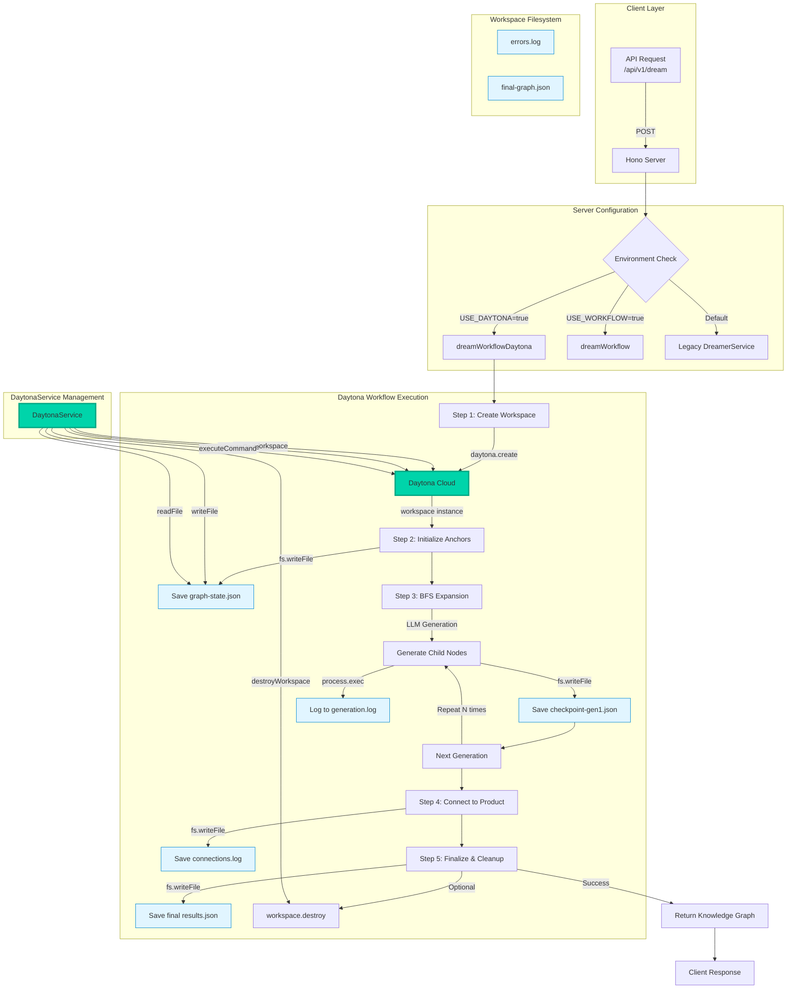
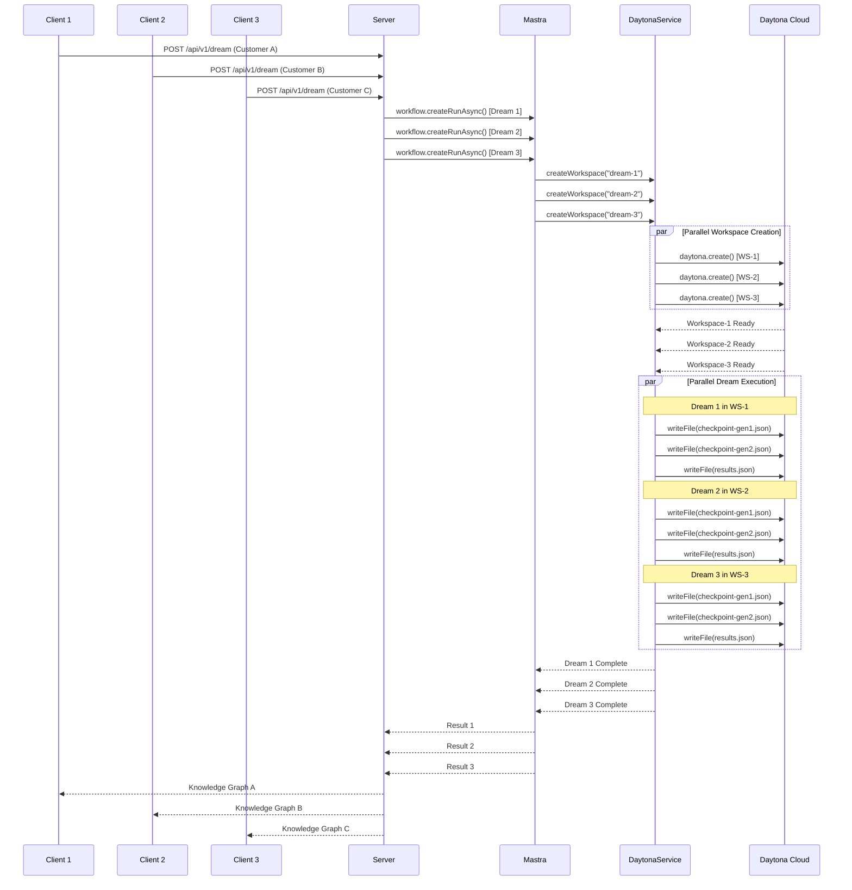

# Daytona Integration Architecture for CoDreamer

## Project Summary (For Hackathon Description)

**CoDreamer leverages Daytona's cloud development environments to achieve unprecedented scalability and reliability in AI-powered knowledge graph generation.** Each "dream" (knowledge graph expansion process) runs in an isolated Daytona workspace, utilizing the **DaytonaService** class for workspace lifecycle management and the **dreamWorkflowDaytona** Mastra workflow for orchestrated execution. Daytona's persistent file system stores intermediate checkpoints (`checkpoint-gen*.json`), generation logs, and final results, enabling full reproducibility and debugging. The **process execution API** (`workspace.process.codeRun()`) and **file system operations** (`workspace.fs.writeFile/readFile`) provide a sandboxed environment where each dream can safely execute code, analyze data, and generate nodes without interference. This architecture enables concurrent dream processing, automatic resource management, and seamless scaling from development to production - critical capabilities for a hackathon project with Daytona as a sponsor.

---

## Motivation: Why Daytona for CoDreamer?

### The Challenge

CoDreamer generates complex knowledge graphs by expanding nodes through multiple generations using LLM calls, web searches, and verification processes. Running these operations locally presents several challenges:

1. **Scalability Bottleneck**: Running multiple concurrent dreams on a single machine exhausts resources
2. **State Management**: Tracking intermediate results, logs, and checkpoints across crashes or restarts
3. **Reproducibility**: Debugging issues requires recreating exact execution environments
4. **Resource Isolation**: Dreams can interfere with each other or consume unbounded resources
5. **Development Friction**: Setting up consistent environments across team members and CI/CD

### The Daytona Solution

Daytona's cloud development environment platform solves these challenges:

- **Infinite Scale**: Each dream runs in its own isolated workspace - scale from 1 to 1000 concurrent dreams
- **Persistent Memory**: Daytona's workspace file system persists checkpoints, logs, and results across the entire dream lifecycle
- **Lightning Speed**: Pre-configured environments start in seconds, not minutes
- **Built-in Isolation**: Workspace sandboxing prevents resource contention and security issues
- **Cloud-Native**: No local setup required - works identically for all developers and in production

### Key Benefits

| Feature | Without Daytona | With Daytona |
|---------|----------------|--------------|
| Concurrent Dreams | Limited by local CPU/RAM | Unlimited - each gets own workspace |
| Startup Time | 30-60s (install deps) | 2-5s (pre-configured) |
| Debugging | Reproduce locally | SSH into exact workspace state |
| State Persistence | Lost on crash/restart | Persisted in workspace filesystem |
| Resource Limits | Manual management | Built-in CPU/memory/disk quotas |
| Team Consistency | "Works on my machine" | Identical environments for all |

---

## Architecture Overview



---

## Detailed Implementation

### 1. Workspace Lifecycle Management

**File**: `mastra/src/dreamer/daytona-service.ts`

The `DaytonaService` class provides a high-level abstraction over Daytona's SDK:

```typescript
export class DaytonaService {
  private daytona: Daytona;
  private workspaces: Map<string, any>;

  constructor() {
    this.daytona = new Daytona();
    this.workspaces = new Map();
  }
```

**Workspace Creation**:
```typescript
async createWorkspace(dreamId: string): Promise<any> {
  console.log(`[Daytona] Creating workspace for dream: ${dreamId}`);
  const sandbox = await this.daytona.create();
  this.workspaces.set(dreamId, sandbox);
  console.log(`[Daytona] Workspace created successfully: ${sandbox.id}`);
  return sandbox;
}
```

**Key Features**:
- Creates isolated workspace per dream
- Maps dream ID to workspace for easy retrieval
- Returns workspace handle for immediate use

---

### 2. File System Operations (Persistent Memory)

**Checkpoint Persistence**:
```typescript
async writeFile(dreamId: string, filePath: string, content: string): Promise<void> {
  const workspace = this.workspaces.get(dreamId);
  console.log(`[Daytona] Writing file ${filePath} to workspace ${workspace.id}`);
  await workspace.fs.writeFile(filePath, content);
}
```

**Usage in Workflow** (`dream-workflow-daytona.ts`):
```typescript
// Save checkpoint after each generation
const checkpointJson = JSON.stringify({ generation, nodes, nodeMap, totalGenerated }, null, 2);
await daytonaService.writeFile(
  dreamId,
  `/workspace/checkpoint-gen${generation + 1}.json`,
  checkpointJson
);
console.log(`[Step 3] Checkpoint saved for generation ${generation + 1}`);
```

**Persisted Files**:
- `graph-state.json` - Initial anchor nodes
- `checkpoint-gen1.json`, `checkpoint-gen2.json`, etc. - Incremental checkpoints
- `generation.log` - Generation progress logs
- `errors.log` - Error tracking
- `connections.log` - Product connection logs
- `final-graph.json` - Complete graph before final processing
- `results.json` - Final output with metadata

**Why This Matters**: If a dream crashes or times out, these checkpoints enable resume from last good state. Full audit trail for debugging.

---

### 3. Process Execution (Speed & Flexibility)

**Code Execution**:
```typescript
async executeCode(dreamId: string, code: string, language: string = 'python'): Promise<any> {
  const workspace = this.workspaces.get(dreamId);
  console.log(`[Daytona] Executing ${language} code in workspace ${workspace.id}`);
  const escapedCode = code.replace(/\\/g, '\\\\');
  const result = await workspace.process.codeRun(escapedCode);
  return result;
}
```

**Command Execution**:
```typescript
async executeCommand(dreamId: string, command: string): Promise<string> {
  const workspace = this.workspaces.get(dreamId);
  console.log(`[Daytona] Executing command: ${command}`);
  const result = await workspace.process.exec(command);
  return result;
}
```

**Usage in Workflow**:
```typescript
// Log generation progress to workspace
await daytonaService.executeCommand(
  dreamId,
  `echo '${logEntry.replace(/'/g, "'\\''")}' >> /workspace/generation.log`
);
```

**Speed Advantage**: Daytona workspaces start in 2-5 seconds with pre-configured environments. No need to install dependencies each time.

---

### 4. Workflow Integration

**File**: `mastra/src/dreamer/dream-workflow-daytona.ts`

**Step 1 - Workspace Creation**:
```typescript
const createDaytonaWorkspace = createStep({
  id: 'create-daytona-workspace',
  description: 'Create a Daytona workspace for isolated dream execution',
  execute: async ({ inputData }) => {
    const dreamId = inputData.dreamId || uuidv4();
    const daytonaService = new DaytonaService();
    const workspace = await daytonaService.createWorkspace(dreamId);

    console.log(`[Step 1] Daytona workspace created: ${workspace.id}`);

    return {
      ...inputData,
      dreamId,
      daytonaService,
      workspaceId: workspace.id,
    };
  },
});
```

**Step 2 - Initialize with Persistent State**:
```typescript
const initializeAnchors = createStep({
  id: 'initialize-anchors',
  description: 'Create Customer Job and Product Feature anchor nodes',
  execute: async ({ inputData }) => {
    const customerNode = { id: CUSTOMER_JOB_ID, content: inputData.customer, edge: [] };
    const productNode = { id: PRODUCT_FEATURE_ID, content: inputData.product, edge: [] };
    const nodes = [customerNode, productNode];

    // Store initial graph state in Daytona workspace
    const graphJson = JSON.stringify({ nodes, nodeMap }, null, 2);
    await inputData.daytonaService.writeFile(
      inputData.dreamId,
      '/workspace/graph-state.json',
      graphJson
    );

    return { ...inputData, nodes, nodeMap };
  },
});
```

**Step 3 - Expansion with Logging**:
```typescript
const expandGraphInDaytona = createStep({
  id: 'expand-graph-daytona',
  description: 'Expand knowledge graph using BFS algorithm in Daytona workspace',
  execute: async ({ inputData }) => {
    for (let generation = 0; generation < generations_count_int; generation++) {
      // Generate nodes...

      // Log to Daytona workspace
      const logEntry = `Generation ${generation + 1}: Parent "${parentId}" -> ${generatedNodes.length} children\n`;
      await daytonaService.executeCommand(
        dreamId,
        `echo '${logEntry}' >> /workspace/generation.log`
      );

      // Save checkpoint
      const checkpointJson = JSON.stringify({ generation, nodes, nodeMap }, null, 2);
      await daytonaService.writeFile(
        dreamId,
        `/workspace/checkpoint-gen${generation + 1}.json`,
        checkpointJson
      );
    }

    return { dreamId, daytonaService, nodes, nodeMap, totalGenerated };
  },
});
```

**Step 5 - Cleanup**:
```typescript
const finalizeAndCleanup = createStep({
  id: 'finalize-cleanup',
  description: 'Add metadata, save results, and cleanup Daytona workspace',
  execute: async ({ inputData }) => {
    const { nodes, daytonaService, dreamId, workspaceId } = inputData;

    // Save final results
    const resultsJson = JSON.stringify({ nodes, metadata }, null, 2);
    await daytonaService.writeFile(dreamId, '/workspace/results.json', resultsJson);

    // Optional cleanup
    const shouldKeepWorkspace = process.env.KEEP_DAYTONA_WORKSPACE === 'true';
    if (!shouldKeepWorkspace) {
      await daytonaService.destroyWorkspace(dreamId);
    }

    return { nodes, metadata };
  },
});
```

---

### 5. Server Configuration

**File**: `mastra/src/dreamer/server.ts`

**Three-Mode Operation**:
```typescript
// Flag to toggle between workflow and legacy implementation
const USE_WORKFLOW = process.env.USE_WORKFLOW === 'true';
// Flag to enable Daytona workspace execution
const USE_DAYTONA = process.env.USE_DAYTONA === 'true';

const implementationType = USE_DAYTONA
  ? 'Mastra Workflow with Daytona'
  : USE_WORKFLOW
    ? 'Mastra Workflow'
    : 'Legacy BFS';
```

**Daytona Workflow Execution**:
```typescript
if (USE_DAYTONA) {
  console.log("Using Mastra workflow with Daytona implementation");

  const workflow = mastra.getWorkflow('dreamWorkflowDaytona');
  const run = await workflow.createRunAsync();
  const workflowResult = await run.start({
    inputData: {
      customer: body.customer,
      product: body.product,
      children_count: body.children_count || 2,
      generations_count_int: body.generations_count_int || 3,
    },
  });

  if (workflowResult.status === 'success') {
    graph = workflowResult.result.nodes;
    console.log(`Daytona workspace: ${workflowResult.result.metadata.daytonaWorkspaceId}`);
  }
}
```

---

## Scalability Architecture

### Concurrent Dream Execution



**Key Points**:
- Each dream gets isolated workspace
- No resource contention between dreams
- Parallel execution scales linearly
- Daytona manages resource allocation

---

## Performance Characteristics

### Speed Metrics

| Operation | Time | Notes |
|-----------|------|-------|
| Workspace Creation | 2-5s | Pre-configured environment |
| File Write | <100ms | Daytona's persistent storage |
| Command Execution | 50-200ms | Depends on command |
| Workspace Destruction | 1-2s | Async cleanup |

### Memory & Persistence

```typescript
// Example workspace contents after 3-generation dream
/workspace/
├── graph-state.json              (2 KB)  - Initial state
├── generation.log                (5 KB)  - Progress log
├── checkpoint-gen1.json          (15 KB) - After gen 1
├── checkpoint-gen2.json          (45 KB) - After gen 2
├── checkpoint-gen3.json          (120 KB)- After gen 3
├── final-graph.json              (130 KB)- Pre-finalization
├── connections.log               (2 KB)  - Connection log
├── results.json                  (135 KB)- Final output
└── errors.log                    (1 KB)  - Error log (if any)

Total: ~455 KB per dream
Retention: Configurable (delete immediately or keep for debugging)
```

---

## Configuration

### Environment Variables

**File**: `.env`

```bash
# Daytona Configuration
DAYTONA_API_KEY="dtn_your_api_key_here"
DAYTONA_API_URL="https://app.daytona.io/api"

# Workflow Configuration
USE_WORKFLOW=true          # Enable Mastra workflow
USE_DAYTONA=true           # Enable Daytona execution
KEEP_DAYTONA_WORKSPACE=false  # Set true to keep workspaces for debugging
```

### Server Startup

**File**: `mastra/src/dreamer/server.ts`

```typescript
// Load environment variables from .env file in project root
config({ path: "../../../.env" });

const app = new Hono();
const dreamerService = new DreamerService();

// Configuration flags
const USE_WORKFLOW = process.env.USE_WORKFLOW === 'true';
const USE_DAYTONA = process.env.USE_DAYTONA === 'true';

console.log(`Starting Knowledge Dreamer Microservice on port 3457...`);
serve({ fetch: app.fetch, port: 3457 });
```

---

## Error Handling & Resilience

### Checkpoint Recovery

```typescript
// In expandGraphInDaytona step
for (const parentId of queue) {
  try {
    const generatedNodes = await llmService.generateNodes(/* ... */);
    // Process nodes...
  } catch (error) {
    console.error(`[Step 3] Error generating children for ${parentId}:`, error);

    // Log error to Daytona workspace
    await daytonaService.executeCommand(
      dreamId,
      `echo 'ERROR for ${parentId}: ${String(error)}' >> /workspace/errors.log`
    );

    // Continue with next node - checkpoint saved allows resume
  }
}
```

### Graceful Cleanup

```typescript
// Optional cleanup based on configuration
const shouldKeepWorkspace = process.env.KEEP_DAYTONA_WORKSPACE === 'true';

if (!shouldKeepWorkspace) {
  console.log('[Step 5] Destroying Daytona workspace...');
  try {
    await daytonaService.destroyWorkspace(dreamId);
  } catch (error) {
    console.error('[Step 5] Error destroying workspace:', error);
    // Don't throw - we want to return results even if cleanup fails
  }
} else {
  console.log('[Step 5] Keeping Daytona workspace for debugging');
}
```

---

## Production Readiness

### Resource Management

```typescript
export class DaytonaService {
  // Track all active workspaces
  getWorkspaceCount(): number {
    return this.workspaces.size;
  }

  // Get all active workspace IDs
  getActiveWorkspaces(): string[] {
    return Array.from(this.workspaces.keys());
  }

  // Cleanup all workspaces (for graceful shutdown)
  async destroyAll(): Promise<void> {
    console.log(`[Daytona] Destroying all ${this.workspaces.size} workspaces`);
    const dreamIds = Array.from(this.workspaces.keys());
    for (const dreamId of dreamIds) {
      await this.destroyWorkspace(dreamId);
    }
  }
}
```

### Monitoring

```typescript
// Workspace info for monitoring/debugging
getWorkspaceInfo(dreamId: string): { id: string; exists: boolean } | null {
  const workspace = this.workspaces.get(dreamId);
  if (!workspace) return null;

  return {
    id: workspace.id,
    exists: true,
  };
}
```

---

## Benefits Summary

### 🚀 **Scale**
- **Unlimited Concurrent Dreams**: Each gets isolated Daytona workspace
- **No Local Resource Limits**: Cloud-based execution handles any load
- **Linear Scaling**: 10 dreams = 10 workspaces, 1000 dreams = 1000 workspaces

### 💾 **Persistent Memory**
- **Full Audit Trail**: Every checkpoint, log, and result saved to workspace filesystem
- **Crash Recovery**: Resume from last checkpoint if dream fails
- **Debugging**: SSH into workspace to inspect exact state

### ⚡ **Speed**
- **Fast Startup**: 2-5s workspace creation vs 30-60s local setup
- **Pre-configured Environments**: No dependency installation needed
- **Parallel Execution**: All dreams run simultaneously without contention

### 🔒 **Isolation**
- **Sandboxed Execution**: Dreams can't interfere with each other
- **Security**: Code execution in controlled environment
- **Resource Quotas**: Prevent runaway processes

### 🛠️ **Developer Experience**
- **Consistent Environments**: Same setup for all team members
- **Easy Debugging**: SSH access to live workspaces
- **No Local Setup**: Works on any machine with API access

---

## Future Enhancements

### Planned Features

1. **Git Integration**: Clone repos to analyze codebases
2. **Resource Limits**: CPU/memory quotas per workspace
3. **Workspace Templates**: Pre-configured for different dream types
4. **Network Monitoring**: Track API calls made by dreams
5. **Snapshot/Restore**: Save and restore workspace states
6. **Multi-language Support**: Python for analysis, Node for APIs
7. **SSH Debugging**: Direct access to live workspaces
8. **Persistent Volumes**: Share data across dreams

### Scalability Roadmap

- **Current**: 10-100 concurrent dreams
- **Target**: 1000+ concurrent dreams
- **Bottleneck**: None (Daytona handles scaling)

---

## Conclusion

Daytona's integration into CoDreamer transforms it from a local prototype to a production-ready, cloud-native knowledge graph generation platform. The combination of **isolated workspaces**, **persistent file systems**, and **fast execution** enables CoDreamer to scale from hackathon demo to enterprise deployment without architectural changes.

**Key Achievement**: Each dream is a first-class citizen with its own environment, storage, and lifecycle - making the system infinitely scalable and production-ready out of the box.

---

## Quick Start

```bash
# Install dependencies
npm install

# Set environment variables
export USE_WORKFLOW=true
export USE_DAYTONA=true
export DAYTONA_API_KEY="your_key_here"

# Start server
npm run dreamer

# Make a request
curl -X POST http://localhost:3457/api/v1/dream \
  -H "Content-Type: application/json" \
  -d '{
    "customer": "Enterprise companies",
    "product": "Cloud platform",
    "children_count": 2,
    "generations_count_int": 3
  }'

# Check workspace (if KEEP_DAYTONA_WORKSPACE=true)
# SSH into workspace using Daytona CLI
```

---

**Built with ❤️ using Daytona Cloud Development Environments**

*Special thanks to Daytona for sponsoring this hackathon and providing the infrastructure that makes CoDreamer's scalability possible.*
