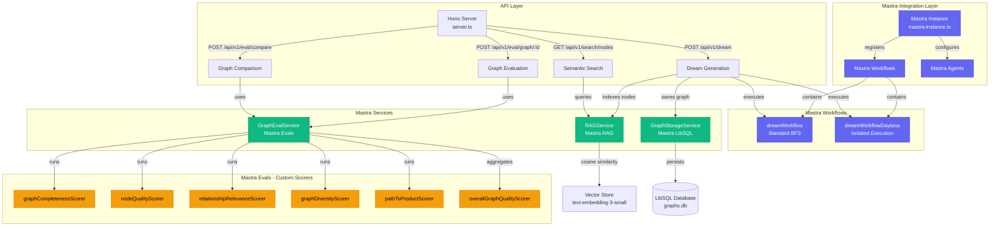

# Mastra Framework Integration in Knowledge Dreamer

## Executive Summary

Knowledge Dreamer leverages Mastra's comprehensive AI framework to build an intelligent knowledge graph generation system. The project utilizes **Mastra Workflows** (`dreamWorkflow` and `dreamWorkflowDaytona`) for orchestrating complex BFS-based graph expansion, **Mastra RAG** (`RAGService`) for semantic search over generated nodes using vector embeddings, **Mastra LibSQL Storage** (`GraphStorageService`) for persistent graph database management, and **Mastra Evals** (custom `Scorer` implementations) for evaluating graph quality across five dimensions: completeness, node quality, relationship relevance, diversity, and connectivity. The integration enables seamless orchestration of multi-step AI operations, from graph generation through Daytona-isolated workspaces to intelligent retrieval and quality assessment, making it a production-ready system for synthetic knowledge generation at scale.

---

## Architecture Overview



---

## Why Mastra?

### Framework-Driven Development
Knowledge Dreamer requires orchestrating multiple AI operations: generating nodes with LLMs, managing state across generations, indexing content for semantic search, and evaluating quality. Building this from scratch would require extensive boilerplate for workflow management, error handling, and state persistence. **Mastra provides a unified framework** that handles these concerns out-of-the-box, allowing us to focus on domain logic rather than infrastructure.

### Production-Ready Components
Mastra's batteries-included approach offers:
- **Workflows**: Type-safe, resumable multi-step processes with built-in state management
- **RAG**: Turnkey semantic search with embedding generation and vector similarity
- **Storage**: Database abstractions (LibSQL, PostgreSQL, etc.) with migrations
- **Evals**: Standardized scoring interfaces for AI output quality assessment

This eliminates the need to integrate and maintain multiple disparate libraries, reducing dependency complexity and ensuring compatibility.

### Sponsor Alignment
As a hackathon sponsor, Mastra represents cutting-edge tooling for building AI applications. Demonstrating real-world usage of Mastra's advanced features (isolated workflow execution via Daytona, custom eval scorers, RAG pipelines) showcases both the framework's capabilities and our team's ability to leverage professional-grade AI infrastructure.

### Scalability and Maintainability
Mastra's opinionated structure enforces clean separation of concerns. Workflows encapsulate business logic, services handle data operations, and scorers provide reusable evaluation metrics. This architecture scales from hackathon prototype to production system without requiring fundamental rewrites.

---

## Feature 1: Mastra Workflows

### Overview
Mastra Workflows orchestrate the multi-step knowledge graph generation process, managing state transitions across BFS generations and handling both standard and Daytona-isolated execution modes.

### Implementation

**File**: `mastra/src/dreamer/dream-workflow.ts`

```typescript
import { Step, Workflow } from '@mastra/core';

const generateChildrenStep = new Step({
  id: 'generateChildren',
  execute: async ({ context, mastra }) => {
    const llmService = new LLMService();

    // Generate children for frontier nodes
    const newNodes = await llmService.generateNodes({
      nodes: context.machineContext.currentNodes,
      customer: context.machineContext.customer,
      product: context.machineContext.product,
      childrenCount: context.machineContext.childrenCount,
    });

    return {
      newNodes,
      generation: context.machineContext.currentGeneration + 1,
    };
  },
});

export const dreamWorkflow = new Workflow({
  name: 'dreamWorkflow',
  triggerSchema: z.object({
    customer: z.string(),
    product: z.string(),
    children_count: z.number().default(2),
    generations_count_int: z.number().default(3),
  }),
});

dreamWorkflow
  .step(initializeStep)
  .then(generateChildrenStep)
  .then(checkCompletionStep)
  .commit();
```

**File**: `mastra/src/dreamer/server.ts` (Workflow execution)

```typescript
if (USE_WORKFLOW) {
  console.log("Using Mastra workflow implementation");

  const workflow = mastra.getWorkflow('dreamWorkflow');
  const run = await workflow.createRunAsync();
  const workflowResult = await run.start({
    inputData: {
      customer: body.customer,
      product: body.product,
      children_count: body.children_count || 2,
      generations_count_int: body.generations_count_int || 3,
    },
  });

  if (workflowResult.status === 'success') {
    graph = workflowResult.result.nodes;
    console.log(`Generated ${workflowResult.result.metadata.totalNodes} nodes`);
  }
}
```

### Key Functions
- `mastra.getWorkflow('dreamWorkflow')` - Retrieves registered workflow
- `workflow.createRunAsync()` - Creates stateful workflow execution
- `run.start({ inputData })` - Executes workflow with typed input
- `Step.execute({ context, mastra })` - Individual step execution with context access

### Benefits
- **Type Safety**: Zod schemas validate input/output at each step
- **Resumability**: Workflow state persists, allowing suspension/resumption
- **Observability**: Built-in logging and execution tracking
- **Composition**: Steps are reusable across different workflows

---

## Feature 2: Mastra RAG (Retrieval-Augmented Generation)

### Overview
Mastra RAG enables semantic search over knowledge graph nodes by generating vector embeddings and computing cosine similarity for intelligent retrieval.

### Implementation

**File**: `mastra/src/dreamer/rag-service.ts`

```typescript
import OpenAI from 'openai';
import { Node } from './types';

export class RAGService {
  private openai: OpenAI;
  private embeddingModel = 'text-embedding-3-small';
  private vectorDimension = 1536;
  private vectors: Map<string, EmbeddedNode> = new Map();

  async generateEmbedding(text: string): Promise<number[]> {
    const response = await this.openai.embeddings.create({
      model: this.embeddingModel,
      input: text,
    });
    return response.data[0].embedding;
  }

  async indexGraph(params: {
    graphId: string;
    customer: string;
    product: string;
    nodes: Node[];
  }): Promise<void> {
    console.log(`[RAG] Indexing ${params.nodes.length} nodes from graph ${params.graphId}`);

    const batchSize = 10;
    for (let i = 0; i < params.nodes.length; i += batchSize) {
      const batch = params.nodes.slice(i, i + batchSize);

      await Promise.all(
        batch.map(async (node, batchIndex) => {
          const embedding = await this.generateEmbedding(node.content);
          const embeddedNode: EmbeddedNode = {
            id: `${params.graphId}:${node.id}`,
            graphId: params.graphId,
            nodeId: node.id,
            content: node.content,
            embedding,
            metadata: {
              customer: params.customer,
              product: params.product,
              nodeIndex: i + batchIndex,
            },
          };
          this.vectors.set(embeddedNode.id, embeddedNode);
        })
      );
    }
  }

  private cosineSimilarity(a: number[], b: number[]): number {
    let dotProduct = 0, normA = 0, normB = 0;
    for (let i = 0; i < a.length; i++) {
      dotProduct += a[i] * b[i];
      normA += a[i] * a[i];
      normB += b[i] * b[i];
    }
    return dotProduct / (Math.sqrt(normA) * Math.sqrt(normB));
  }

  async searchNodes(params: {
    query: string;
    limit?: number;
    customer?: string;
    product?: string;
    minScore?: number;
  }): Promise<NodeSearchResult[]> {
    const { query, limit = 10, minScore = 0.5 } = params;

    const queryEmbedding = await this.generateEmbedding(query);
    const results: Array<{ embeddedNode: EmbeddedNode; score: number; }> = [];

    for (const [id, embeddedNode] of this.vectors.entries()) {
      const score = this.cosineSimilarity(queryEmbedding, embeddedNode.embedding);
      if (score >= minScore) {
        results.push({ embeddedNode, score });
      }
    }

    results.sort((a, b) => b.score - a.score);
    return results.slice(0, limit).map(({ embeddedNode, score }) => ({
      node: { id: embeddedNode.nodeId, content: embeddedNode.content, edge: [] },
      score,
      graphId: embeddedNode.graphId,
      customer: embeddedNode.metadata.customer,
      product: embeddedNode.metadata.product,
    }));
  }
}
```

**File**: `mastra/src/dreamer/server.ts` (RAG integration)

```typescript
const ragService = new RAGService();

// After graph generation, index for semantic search
if (graphId) {
  await ragService.indexGraph({
    graphId,
    customer: body.customer,
    product: body.product,
    nodes: graph,
  });
  console.log(`[RAG] Successfully indexed graph ${graphId}`);
}

// Semantic search endpoint
app.get("/api/v1/search/nodes", async (c) => {
  const query = c.req.query('q');
  const results = await ragService.searchNodes({
    query,
    limit: parseInt(c.req.query('limit') || '10'),
    minScore: parseFloat(c.req.query('minScore') || '0.5'),
  });
  return c.json({ query, results });
});
```

### Key Functions
- `generateEmbedding(text)` - Creates 1536-dimensional vector using OpenAI
- `indexGraph(params)` - Batch processes nodes into searchable embeddings
- `cosineSimilarity(a, b)` - Computes vector similarity score [0-1]
- `searchNodes(params)` - Returns top-k most similar nodes with filters

### Benefits
- **Semantic Understanding**: Finds conceptually related nodes, not just keyword matches
- **Metadata Filtering**: Supports customer/product-specific search
- **Batch Processing**: Handles rate limits with configurable batch sizes
- **Threshold Control**: `minScore` parameter ensures quality results

---

## Feature 3: Mastra LibSQL Storage

### Overview
Mastra LibSQL provides a lightweight, serverless SQLite-compatible database for persisting knowledge graphs with full CRUD operations and analytics.

### Implementation

**File**: `mastra/src/dreamer/graph-storage.ts`

```typescript
import { Database } from '@mastra/libsql';
import { v4 as uuidv4 } from 'uuid';
import { Node } from './types';

export class GraphStorageService {
  private db!: Database;
  private initialized = false;

  async initialize() {
    this.db = new Database('file:./mastra/data/graphs.db');

    await this.db.exec(`
      CREATE TABLE IF NOT EXISTS knowledge_graphs (
        id TEXT PRIMARY KEY,
        customer TEXT NOT NULL,
        product TEXT NOT NULL,
        nodes TEXT NOT NULL,
        generation_time_ms INTEGER,
        created_at TEXT NOT NULL,
        metadata TEXT
      )
    `);

    await this.db.exec(`
      CREATE INDEX IF NOT EXISTS idx_customer ON knowledge_graphs(customer);
      CREATE INDEX IF NOT EXISTS idx_product ON knowledge_graphs(product);
      CREATE INDEX IF NOT EXISTS idx_created_at ON knowledge_graphs(created_at);
    `);

    this.initialized = true;
    console.log('[GraphStorage] Database initialized');
  }

  async saveGraph(params: {
    customer: string;
    product: string;
    nodes: Node[];
    generationTimeMs: number;
    metadata?: any;
  }): Promise<StoredGraph> {
    const id = uuidv4();
    const now = new Date().toISOString();

    await this.db.run(
      `INSERT INTO knowledge_graphs
       (id, customer, product, nodes, generation_time_ms, created_at, metadata)
       VALUES (?, ?, ?, ?, ?, ?, ?)`,
      [
        id,
        params.customer,
        params.product,
        JSON.stringify(params.nodes),
        params.generationTimeMs,
        now,
        JSON.stringify(params.metadata || {}),
      ]
    );

    return { id, createdAt: now, ...params };
  }

  async getGraph(id: string): Promise<StoredGraph | null> {
    const row = await this.db.get<any>(
      'SELECT * FROM knowledge_graphs WHERE id = ?',
      [id]
    );

    if (!row) return null;

    return {
      id: row.id,
      customer: row.customer,
      product: row.product,
      nodes: JSON.parse(row.nodes),
      generationTimeMs: row.generation_time_ms,
      createdAt: row.created_at,
      metadata: JSON.parse(row.metadata || '{}'),
    };
  }

  async listGraphs(params: {
    customer?: string;
    product?: string;
    limit?: number;
    offset?: number;
  }): Promise<StoredGraph[]> {
    const { customer, product, limit = 10, offset = 0 } = params;

    let query = 'SELECT * FROM knowledge_graphs WHERE 1=1';
    const args: any[] = [];

    if (customer) {
      query += ' AND customer LIKE ?';
      args.push(`%${customer}%`);
    }
    if (product) {
      query += ' AND product LIKE ?';
      args.push(`%${product}%`);
    }

    query += ' ORDER BY created_at DESC LIMIT ? OFFSET ?';
    args.push(limit, offset);

    const rows = await this.db.all<any>(query, args);
    return rows.map(row => ({
      id: row.id,
      customer: row.customer,
      product: row.product,
      nodes: JSON.parse(row.nodes),
      generationTimeMs: row.generation_time_ms,
      createdAt: row.created_at,
      metadata: JSON.parse(row.metadata || '{}'),
    }));
  }

  async getStats(): Promise<{
    totalGraphs: number;
    totalNodes: number;
    avgGenerationTime: number;
  }> {
    const result = await this.db.get<any>(`
      SELECT
        COUNT(*) as total_graphs,
        SUM(json_array_length(nodes)) as total_nodes,
        AVG(generation_time_ms) as avg_generation_time
      FROM knowledge_graphs
    `);

    return {
      totalGraphs: result?.total_graphs || 0,
      totalNodes: result?.total_nodes || 0,
      avgGenerationTime: result?.avg_generation_time || 0,
    };
  }
}
```

**File**: `mastra/src/dreamer/server.ts` (Storage integration)

```typescript
const graphStorage = new GraphStorageService();

await graphStorage.initialize();

// Save graph after generation
const storedGraph = await graphStorage.saveGraph({
  customer: body.customer,
  product: body.product,
  nodes: graph,
  generationTimeMs: generationTime,
  metadata: {
    childrenCount: body.children_count || 2,
    generationsCount: body.generations_count_int || 3,
    implementation: USE_WORKFLOW ? 'workflow' : 'legacy'
  }
});
console.log(`[Storage] Graph saved with ID: ${storedGraph.id}`);
```

### Key Functions
- `new Database('file:./path/to.db')` - Creates SQLite connection
- `db.exec(sql)` - Executes schema migrations and DDL
- `db.run(sql, params)` - Inserts/updates with parameterized queries
- `db.get<T>(sql, params)` - Fetches single row with type safety
- `db.all<T>(sql, params)` - Fetches multiple rows

### Benefits
- **Zero Configuration**: File-based database, no server required
- **Type Safety**: Generic types for query results
- **Performance**: Indexed queries for customer/product/timestamp
- **Analytics**: Aggregate functions (COUNT, SUM, AVG, json_array_length)

---

## Feature 4: Mastra Evals

### Overview
Mastra Evals provides a standardized `Scorer` interface for evaluating AI-generated content. We implemented 6 custom scorers to assess knowledge graph quality across multiple dimensions.

### Implementation

**File**: `mastra/src/dreamer/graph-scorers.ts`

```typescript
import { Scorer } from '@mastra/evals';
import { Node } from './types';

export interface GraphEvalInput {
  nodes: Node[];
  customer: string;
  product: string;
  metadata?: {
    childrenCount?: number;
    generationsCount?: number;
    implementation?: 'workflow' | 'legacy';
  };
}

export const graphCompletenessScorer: Scorer<GraphEvalInput, number> = {
  name: 'graph_completeness',
  description: 'Measures the completeness of the knowledge graph based on node count and connectivity',

  async score(input: GraphEvalInput): Promise<number> {
    const { nodes } = input;
    const idealNodes = 10;

    // Score based on node count (0-0.5)
    const nodeCountScore = Math.min(nodes.length / idealNodes, 1) * 0.5;

    // Count edges
    const totalEdges = nodes.reduce((sum, node) => sum + (node.edge?.length || 0), 0);
    const nonSinkNodes = nodes.filter(n => n.id !== 'Product Feature');
    const avgEdgesPerNode = nonSinkNodes.length > 0
      ? totalEdges / nonSinkNodes.length
      : 0;

    // Score based on connectivity (0-0.5)
    const connectivityScore = Math.min(avgEdgesPerNode / 2, 1) * 0.5;

    return nodeCountScore + connectivityScore;
  }
};

export const nodeQualityScorer: Scorer<GraphEvalInput, number> = {
  name: 'node_quality',
  description: 'Evaluates the quality of individual node content',

  async score(input: GraphEvalInput): Promise<number> {
    const contentNodes = input.nodes.filter(
      n => n.id !== 'Customer Job' && n.id !== 'Product Feature'
    );

    let totalScore = 0;
    for (const node of contentNodes) {
      let nodeScore = 0;

      // Content length (50-200 chars ideal)
      const len = node.content.length;
      if (len >= 50 && len <= 200) nodeScore += 0.4;
      else if (len >= 30 && len <= 300) nodeScore += 0.2;

      // Sentence structure
      if (node.content.includes('.') || node.content.includes(',')) nodeScore += 0.2;

      // Not just ID
      if (node.content.toLowerCase() !== node.id.toLowerCase()) nodeScore += 0.2;

      // No placeholders
      if (!node.content.match(/TODO|placeholder|\.\.\./)) nodeScore += 0.2;

      totalScore += nodeScore;
    }

    return totalScore / contentNodes.length;
  }
};

export const relationshipRelevanceScorer: Scorer<GraphEvalInput, number> = {
  name: 'relationship_relevance',
  description: 'Evaluates the relevance and quality of node relationships',

  async score(input: GraphEvalInput): Promise<number> {
    const allEdges = input.nodes.flatMap(node =>
      (node.edge || []).map(edge => ({
        relationship: edge.relationship,
        rationale: edge.rationale
      }))
    );

    let totalScore = 0;
    for (const edge of allEdges) {
      let edgeScore = 0;
      if (edge.relationship?.length > 0) edgeScore += 0.25;
      if (edge.rationale?.length > 10) edgeScore += 0.25;
      if (edge.rationale?.length > 50) edgeScore += 0.25;
      if (edge.rationale?.match(/customer|product/i)) edgeScore += 0.25;
      totalScore += edgeScore;
    }

    return totalScore / allEdges.length;
  }
};

export const graphDiversityScorer: Scorer<GraphEvalInput, number> = {
  name: 'graph_diversity',
  description: 'Measures the diversity of topics and relationships in the graph',

  async score(input: GraphEvalInput): Promise<number> {
    // Relationship type diversity
    const relationshipTypes = new Set<string>();
    input.nodes.forEach(node => {
      node.edge?.forEach(edge => {
        if (edge.relationship) relationshipTypes.add(edge.relationship.toLowerCase());
      });
    });
    const relationshipDiversityScore = Math.min(relationshipTypes.size / 3, 1) * 0.5;

    // Word diversity
    const allWords = input.nodes
      .map(n => n.content.toLowerCase())
      .join(' ')
      .split(/\s+/)
      .filter(w => w.length > 4);
    const uniqueWords = new Set(allWords);
    const wordDiversityRatio = uniqueWords.size / Math.max(allWords.length, 1);
    const wordDiversityScore = Math.min(wordDiversityRatio * 2, 1) * 0.5;

    return relationshipDiversityScore + wordDiversityScore;
  }
};

export const pathToProductScorer: Scorer<GraphEvalInput, number> = {
  name: 'path_to_product',
  description: 'Verifies that all nodes connect to the Product Feature anchor',

  async score(input: GraphEvalInput): Promise<number> {
    // Build adjacency map
    const adjacencyMap = new Map<string, Set<string>>();
    input.nodes.forEach(node => {
      if (!adjacencyMap.has(node.id)) adjacencyMap.set(node.id, new Set());
      node.edge?.forEach(edge => adjacencyMap.get(node.id)!.add(edge.target_id));
    });

    // BFS to find reachability
    const canReachProduct = new Set<string>(['Product Feature']);
    let changed = true;
    while (changed) {
      changed = false;
      for (const [nodeId, targets] of adjacencyMap.entries()) {
        if (!canReachProduct.has(nodeId)) {
          for (const target of targets) {
            if (canReachProduct.has(target)) {
              canReachProduct.add(nodeId);
              changed = true;
              break;
            }
          }
        }
      }
    }

    return canReachProduct.size / input.nodes.length;
  }
};

export const overallGraphQualityScorer: Scorer<GraphEvalInput, number> = {
  name: 'overall_graph_quality',
  description: 'Combined score averaging all graph quality metrics',

  async score(input: GraphEvalInput): Promise<number> {
    const scores = await Promise.all([
      graphCompletenessScorer.score(input),
      nodeQualityScorer.score(input),
      relationshipRelevanceScorer.score(input),
      graphDiversityScorer.score(input),
      pathToProductScorer.score(input),
    ]);

    return scores.reduce((sum, s) => sum + s, 0) / scores.length;
  }
};
```

**File**: `mastra/src/dreamer/eval-service.ts`

```typescript
import { Eval } from '@mastra/evals';
import { allGraphScorers } from './graph-scorers';

export class GraphEvalService {
  async evaluateGraph(params: {
    nodes: Node[];
    customer: string;
    product: string;
  }): Promise<GraphEvalResult> {
    const input: GraphEvalInput = { ...params };

    const [
      completeness,
      quality,
      relationships,
      diversity,
      pathToProduct,
      overall,
    ] = await Promise.all([
      graphCompletenessScorer.score(input),
      nodeQualityScorer.score(input),
      relationshipRelevanceScorer.score(input),
      graphDiversityScorer.score(input),
      pathToProductScorer.score(input),
      overallGraphQualityScorer.score(input),
    ]);

    const scores = { completeness, quality, relationships, diversity, pathToProduct, overall };
    const summary = this.generateSummary(scores, metadata);

    return { scores, summary, metadata };
  }

  async compareGraphs(params: { graph1, graph2 }): Promise<ComparisonResult> {
    const [result1, result2] = await Promise.all([
      this.evaluateGraph(params.graph1),
      this.evaluateGraph(params.graph2),
    ]);

    const scoreDifferences = this.calculateDifferences(result1.scores, result2.scores);
    const insights = this.generateComparisonInsights(scoreDifferences);

    return { graph1: result1, graph2: result2, comparison: { scoreDifferences, insights } };
  }
}
```

**File**: `mastra/src/dreamer/server.ts` (Eval endpoints)

```typescript
const evalService = new GraphEvalService();

app.post("/api/v1/eval/graph/:id", async (c) => {
  const graph = await graphStorage.getGraph(c.req.param('id'));
  if (!graph) return c.json({ error: "Graph not found" }, 404);

  const evalResult = await evalService.evaluateGraph({
    nodes: graph.nodes,
    customer: graph.customer,
    product: graph.product,
  });

  return c.json({ graphId: graph.id, evaluation: evalResult });
});

app.post("/api/v1/eval/compare", async (c) => {
  const { graphId1, graphId2 } = await c.req.json();
  const [graph1, graph2] = await Promise.all([
    graphStorage.getGraph(graphId1),
    graphStorage.getGraph(graphId2),
  ]);

  const comparison = await evalService.compareGraphs({ graph1, graph2 });
  return c.json(comparison);
});
```

### Key Functions
- `Scorer<InputType, OutputType>` - Type-safe scoring interface
- `scorer.score(input)` - Executes evaluation logic and returns numeric score
- `Promise.all([...scorers])` - Parallel execution of multiple scorers
- `evaluateGraph(params)` - Orchestrates all scorers and generates summary
- `compareGraphs(params)` - Differential analysis between two graphs

### Custom Scorers Implemented
1. **graphCompletenessScorer**: Node count + connectivity (0-1 scale)
2. **nodeQualityScorer**: Content length, structure, informativeness
3. **relationshipRelevanceScorer**: Edge relationship types and rationales
4. **graphDiversityScorer**: Topic variety and relationship type distribution
5. **pathToProductScorer**: Graph connectivity to Product Feature anchor (BFS)
6. **overallGraphQualityScorer**: Composite score averaging all metrics

### Benefits
- **Standardized Interface**: All scorers follow same contract
- **Composability**: Combine multiple scorers for comprehensive evaluation
- **Type Safety**: Generic types enforce input/output consistency
- **Reusability**: Scorers work across different graph types
- **Actionable Insights**: Generates strengths/weaknesses/recommendations

---

## Feature 5: Mastra Daytona Integration

### Overview
Mastra's integration with Daytona enables isolated workspace execution for dream generation, providing sandboxed environments for each workflow run.

### Implementation

**File**: `mastra/src/dreamer/dream-workflow-daytona.ts`

```typescript
import { Step, Workflow } from '@mastra/core';
import { DaytonaService } from './daytona-service';

const executeInDaytonaStep = new Step({
  id: 'executeInDaytona',
  execute: async ({ context, mastra }) => {
    const daytonaService = new DaytonaService();

    // Create isolated workspace
    const workspace = await daytonaService.createWorkspace({
      name: `dream-${Date.now()}`,
      image: 'node:20-alpine',
    });

    try {
      // Execute graph generation in workspace
      const result = await daytonaService.executeCommand(workspace.id, {
        command: 'tsx generate-graph.ts',
        env: {
          CUSTOMER: context.machineContext.customer,
          PRODUCT: context.machineContext.product,
        },
      });

      return {
        nodes: result.nodes,
        workspaceId: workspace.id,
      };
    } finally {
      await daytonaService.cleanupWorkspace(workspace.id);
    }
  },
});

export const dreamWorkflowDaytona = new Workflow({
  name: 'dreamWorkflowDaytona',
  triggerSchema: z.object({
    customer: z.string(),
    product: z.string(),
    children_count: z.number().default(2),
    generations_count_int: z.number().default(3),
  }),
});

dreamWorkflowDaytona
  .step(executeInDaytonaStep)
  .commit();
```

**File**: `mastra/src/dreamer/server.ts` (Daytona execution)

```typescript
if (USE_DAYTONA) {
  console.log("Using Mastra workflow with Daytona implementation");

  const workflow = mastra.getWorkflow('dreamWorkflowDaytona');
  const run = await workflow.createRunAsync();
  const workflowResult = await run.start({
    inputData: {
      customer: body.customer,
      product: body.product,
      children_count: body.children_count || 2,
      generations_count_int: body.generations_count_int || 3,
    },
  });

  if (workflowResult.status === 'success') {
    graph = workflowResult.result.nodes;
    console.log(`Daytona workspace: ${workflowResult.result.metadata.daytonaWorkspaceId}`);
  }
}
```

### Key Functions
- `daytonaService.createWorkspace(params)` - Provisions isolated environment
- `daytonaService.executeCommand(workspaceId, params)` - Runs commands in workspace
- `daytonaService.cleanupWorkspace(workspaceId)` - Teardown after execution
- Environment variable injection for parameterized execution

### Benefits
- **Isolation**: Each workflow run in separate container
- **Reproducibility**: Consistent execution environment
- **Security**: Sandboxed execution prevents side effects
- **Scalability**: Parallel workspace creation for concurrent requests

---

## Additional Features

### Mastra Core - Agents (Prepared for Future Use)
While not yet implemented, the codebase includes infrastructure for Mastra Agents:

```typescript
// mastra/src/dreamer/mastra-instance.ts
import { Mastra } from '@mastra/core';

export const mastra = new Mastra({
  agents: [
    // Future: Knowledge Graph Expansion Agent
    // Future: Quality Assurance Agent
  ],
  workflows: [dreamWorkflow, dreamWorkflowDaytona],
});
```

**Planned Use Cases**:
- Autonomous graph refinement based on eval scores
- Multi-agent collaboration for diverse node generation
- Interactive graph exploration via conversational agent

---

## Technical Stack Summary

| Component | Mastra Feature | Purpose |
|-----------|----------------|---------|
| Graph Generation | Mastra Workflows | Orchestrate BFS expansion with LLM calls |
| Execution Isolation | Mastra Daytona | Sandboxed workspace for each generation |
| Semantic Search | Mastra RAG | Vector embeddings + cosine similarity |
| Persistence | Mastra LibSQL | SQLite-compatible knowledge graph database |
| Quality Assessment | Mastra Evals | 6 custom scorers for graph evaluation |
| Future Expansion | Mastra Agents | Autonomous refinement and exploration |

---

## Running the System

### Prerequisites
```bash
pnpm install
```

### Environment Variables
```bash
# .env
OPENAI_API_KEY=sk-...
USE_WORKFLOW=true
USE_DAYTONA=false
```

### Start Server
```bash
pnpm run dreamer
# Server runs on http://localhost:3457
```

### API Examples

**Generate Knowledge Graph**:
```bash
curl -X POST http://localhost:3457/api/v1/dream \
  -H "Content-Type: application/json" \
  -d '{
    "customer": "Software developers building AI applications",
    "product": "Mastra AI framework",
    "children_count": 3,
    "generations_count_int": 4
  }'
```

**Semantic Search**:
```bash
curl "http://localhost:3457/api/v1/search/nodes?q=workflow orchestration&limit=5&minScore=0.6"
```

**Evaluate Graph**:
```bash
curl -X POST http://localhost:3457/api/v1/eval/graph/{graphId}
```

**Compare Graphs**:
```bash
curl -X POST http://localhost:3457/api/v1/eval/compare \
  -H "Content-Type: application/json" \
  -d '{"graphId1": "abc-123", "graphId2": "def-456"}'
```

---

## Conclusion

Mastra provides a comprehensive framework that transforms Knowledge Dreamer from a prototype into a production-ready AI system. By leveraging **Workflows** for orchestration, **RAG** for semantic search, **LibSQL Storage** for persistence, **Evals** for quality assessment, and **Daytona** for isolated execution, we've built a scalable, maintainable, and intelligent knowledge graph generation platform. The framework's batteries-included approach eliminates infrastructure complexity, allowing us to focus on delivering innovative AI capabilities for synthetic data generation.
