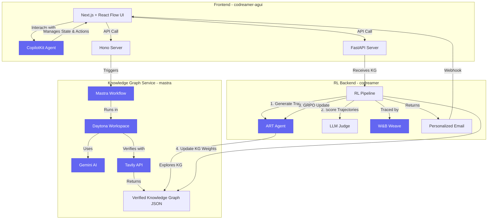

# CO-DREAMER: Passively discovering and learning new knowledge.

Today's AI is short-sighted and sales outreach is impersonal. Existing systems are reactive, responding only when prompted, and they struggle with the factual, multi-step reasoning needed for genuine personalization.

**Co-Dreamer** tackles these problems with a novel approach: we let our AI "dream." It is an end-to-end system where an AI agent passively discovers and expands its own knowledge graph. To combat the critical issue of hallucination, every piece of self-acquired knowledge is verified against real-world sources, creating a reliable foundation for complex reasoning. This allows the agent to generate deeply personalized sales outreach that is continuously improved through a reinforcement learning loop. The entire process is managed through a unique human-in-the-loop interface where the UI state is shared directly with the LLM agent, enabling seamless, conversational control.

> **Built for WeaveHacks 2025**, focusing on the **"Self-Improving Agents"** and **"Reinforcement Learning"** tracks.

**Table of Contents:** [Key Technical Innovations](#-key-technical-innovations) · [Our Sponsors](#-our-sponsors--how-we-used-their-tech) · [Architecture Overview](#️-architecture-overview) · [Core Concepts](#-core-concepts) · [Getting Started](#-getting-started) · [User Flow & Example](#-user-flow--example) · [Tech Stack](#️-tech-stack) · [What is Co-Dreamer?](#-what-is-co-dreamer) · [What's Next](#-whats-next-for-co-dreamer)

---

## 📽️ Quick Overview

### Slide 1: The Problem & Our Solution

**The Problem**

| AI Agents are Short-Sighted | Sales Outreach is Impersonal |
|------------------------------|------------------------------|
| They answer questions, but they don't think ahead or build deep understanding. | It often fails because it lacks a clear, logical, multi-step argument. |

**Our Solution: Let the AI Dream**

A "dream" is an automated process that builds a verified knowledge graph, discovering the logical path from a customer's problem to a product's solution.

```
Customer + Product  →  [Dream Process]  →  Knowledge Graph
```

**How it Works:**

- **Orchestration**: A Mastra workflow initiates the dream.
- **Isolation**: The entire process runs in a sandboxed Daytona workspace.
- **Generation**: Google Gemini expands the knowledge graph by creating new conceptual nodes.
- **Verification**: Every new fact is verified against the live web with the Tavily API.

**The result** is a rich, factual, and deeply reasoned map of product-market fit.

---

### Slide 2: From Dream to Action

**The Reinforcement Learning Loop**

We use the "dreamed" knowledge to power a self-improving agent that learns to create the most effective outreach.

```
Knowledge Graph  →  RL Agent  →  Email  →  Feedback  →  [RL Agent & KG Scores]
                      ↑________________________________________________|
```

**How it Works:**

- **Reason**: An RL agent, built with ART from OpenPipe, traverses the graph to find the most persuasive argument path.
- **Act**: It generates a personalized email that presents a compelling, step-by-step case for the product.
- **Learn**: Real-world feedback (opens, replies) is used to score the argument paths. High-performing paths are reinforced, making the agent smarter over time.

**A Fully Integrated, Production-Ready System**

- **End-to-End Tracing**: The entire pipeline, from trajectory generation to the GRPO update, is tracked and visualized with W&B Weave.
- **Interactive UI**: Our frontend, built with AG-UI from CopilotKit, provides a dynamic interface for visualizing the graph and interacting with the agent.

**This creates a virtuous cycle**: the agent doesn't just act—it learns, reasons, and improves with every single interaction.

---

## 🚀 Key Technical Innovations

**Co-Dreamer is not just another LLM wrapper.** It's a self-improving system that autonomously learns, verifies truth, and optimizes through reinforcement learning—all running in scalable cloud infrastructure.

### What Makes Us Different

- **🧠 Autonomous Knowledge Expansion via BFS Graph Generation** - AI "dreams" new knowledge by generating atomic facts and multi-hop reasoning paths in Daytona cloud containers (not static RAG retrieval)
- **✅ Real-Time Web-Grounded Fact Verification** - Every generated node is verified against live web search (Tavily) with confidence scoring and source citations (not hallucination-prone LLM outputs)
- **🔄 Closed-Loop GRPO Reinforcement Learning** - Agent continuously improves from real-world feedback using Group Relative Policy Optimization via ART/OpenPipe (not static prompt engineering)
- **🎯 Graph-Structured RAG with Explicit Reasoning Paths** - Typed edges and pathfinding algorithms enable multi-hop inference and traceable arguments (not flat vector similarity search)
- **🔬 Dreaming in the Cloud via Isolated Containers** - Each dream runs in ephemeral Daytona cloud containers with checkpointing and parallel processing (not local execution bottlenecks)
- **🎨 Natural Language Batch Graph Editing** - Single CopilotKit commands update dozens of nodes with bidirectional UI-agent sync (not manual JSON editing)
- **📊 End-to-End RL Pipeline Observability** - W&B Weave traces every trajectory, score, and policy update with visual reward attribution (not black-box training)
- **🏗️ Production-Ready Monorepo Architecture** - TypeScript frontend, Mastra workflows, Python RL backend with type-safe APIs (not fragmented repos)

---

## ✨ Our Sponsors & How We Used Their Tech

This project was made possible by leveraging the powerful tools provided by our sponsors. We integrated their technologies to build a robust, production-ready, and scalable AI system in just 48 hours.

| Sponsor                 | How We Used It                                                                                                                                                                 | Learn More                                                              |
| ----------------------- | ------------------------------------------------------------------------------------------------------------------------------------------------------------------------------ | ----------------------------------------------------------------------- |
| **W&B Weave**           | For end-to-end tracing and observability of our entire RL pipeline, from trajectory generation to reward scoring and model updates.                                            | [W&B Weave Details](./WANDB_WEAVE.md)                                   |
| **Mastra**              | As the core TypeScript framework to orchestrate our complex, multi-step knowledge graph generation workflows and manage agent state.                                           | [Mastra Usage](./mastra/README.md)                                      |
| **Daytona**             | To run each "dream" (KG generation) in isolated cloud containers—enabling truly parallel, scalable knowledge graph generation in the cloud without local resource constraints. | [daytona-service.ts](./mastra/src/dreamer/daytona-service.ts)           |
| **AG-UI (CopilotKit)**  | To build the interactive frontend, enabling real-time visualization of the knowledge graph and allowing users to edit the graph via a natural language chat agent.             | [CopilotKit Integration](./COPILOTKIT.md)                               |
| **Tavily**              | For real-time fact-checking of every piece of knowledge the AI "dreams" up, ensuring our knowledge graph is built on a foundation of truth.                                    | [verification-service.ts](./mastra/src/dreamer/verification-service.ts) |
| **ART (from OpenPipe)** | As the serverless reinforcement learning framework to fine-tune our agent using Group Relative Policy Optimization (GRPO) on feedback from email performance.                  | [ART RL Details](./ART_RL.md)                                           |
| **Google Cloud**        | Powering our knowledge generation with the Gemini 2.5 Flash-Lite model for fast, cost-effective, and high-quality structured JSON output.                                      | [llm-service.ts](./mastra/src/dreamer/llm-service.ts)                   |

---

## 🏛️ Architecture Overview

Co-Dreamer is a full-stack monorepo system composed of a frontend UI, a knowledge graph generation service, and a reinforcement learning backend.



> **📊 For detailed workflow diagrams:**
>
> - **Frontend UI & CopilotKit integration** (React Flow canvas, agent actions, workflow states): [COPILOTKIT.md](./COPILOTKIT.md)
> - **Knowledge Graph generation** (BFS expansion, Daytona workspace lifecycle, fact verification): [mastra/README.md](./mastra/README.md)
> - **Reinforcement Learning pipeline** (trajectory generation, GRPO updates, KG weight updates): [ART_RL.md](./ART_RL.md)

---

## 🧠 Core Concepts

### 1. The "Dream": Knowledge Graph Generation in the Cloud

The process starts with a **"dream,"** where the system autonomously builds a knowledge graph.

- **Input**: A customer description (Customer Job) and a product description (Product Feature).
- **Process**: A Mastra workflow, running in an isolated Daytona cloud container, uses Gemini to generate new "nodes" (atomic facts) that logically connect the customer to the product.
- **Verification**: Each new node is fact-checked against the web using Tavily.
- **Output**: A JSON knowledge graph representing a verified, multi-step argument path.
- **Cloud Execution**: The entire dream runs in an ephemeral cloud container, enabling parallel processing of multiple knowledge graphs simultaneously.

### 2. The Action: Reinforcement Learning for Outreach

The generated knowledge graph is fed into a reinforcement learning pipeline to train an agent that crafts personalized sales emails.

- **Reasoning**: An ART (OpenPipe) agent explores the graph to find the most persuasive paths.
- **Training**: It generates multiple email variations (trajectories), which are scored by an LLM Judge. The agent is then updated via GRPO, learning which arguments are most effective.
- **Observability**: The entire learning loop is traced and visualized with W&B Weave.
- **Output**: A highly-personalized email with citations linking back to the facts in the knowledge graph.

### 3. The Interface: Human-in-the-Loop

The frontend, built with AG-UI (CopilotKit), allows a human to be in the loop.

- **Visualization**: The knowledge graph is rendered interactively using React Flow.
- **Interaction**: Users can talk to an agent to create, edit, or delete nodes and edges using natural language.
- **Workflow**: A multi-step UI guides the user from input, to KG refinement, to final email generation.

---

## 🚀 Getting Started

Co-Dreamer consists of **two separate services** that must be run concurrently: the backend (`codreamer`) and the frontend (`codreamer-agui`).

### Prerequisites

- **Node.js 18+** and npm
- **Python 3.10+** and `uv` (or pip)
- An **OpenAI API Key**

### Step 1: Clone the Repository

```bash
# This monorepo contains both frontend and backend services.
git clone <your-repo-url>
cd co-dreamer
```

### Step 2: Set Up & Run the Backend (`codreamer`)

The backend handles the Reinforcement Learning pipeline.

```bash
# Navigate to the backend directory
cd codreamer

# Install dependencies using uv (recommended) or pip
uv sync
# or: pip install -e .

# Set up your environment variables
cp .env.example .env
# Add your OPENAI_API_KEY and optionally WANDB_API_KEY to the .env file

# Run the backend API server
uv run api
# The server will start on http://localhost:8000
```

**Keep this terminal running.**

### Step 3: Set Up & Run the Frontend (`codreamer-agui`)

The frontend contains the UI and the knowledge graph generation service (mastra).

```bash
# In a new terminal, navigate to the frontend directory
cd codreamer-agui

# Install dependencies
npm install

# Set up your environment variables
cp .env.example .env.local
# Add your NEXT_PUBLIC_CODREAMER_API_URL=http://localhost:8000
# And your Gemini/Tavily keys for the KG service

# Run the frontend development server
npm run dev
# The frontend will be available at http://localhost:3000
```

### Step 4: Run the Knowledge Graph Service (mastra)

The mastra service is automatically started by the frontend's Next.js server when you generate a knowledge graph. Ensure your `GEMINI_API_KEY` and `TAVILY_API_KEY` are in `.env.local`.

---

## 📖 User Flow & Example

1. **Open the App**: Navigate to http://localhost:3000.

2. **Step 1: Input Data**:

   - In the "Input Form" on the left, you'll see pre-filled descriptions for a customer ("Pearls of Wisdom") and a product ("W&B Weave").
   - Click the **"Generate KG"** button.

3. **The Dream Happens in the Cloud**:

   - The Mastra service spins up an isolated Daytona cloud container.
   - Inside the container, it calls Gemini to generate nodes and Tavily to verify them.
   - A knowledge graph will appear on the canvas, with nodes automatically arranged.
   - The container is automatically cleaned up after the dream completes.

4. **Step 2: Refine the Graph**:

   - Review the generated nodes. You can drag them, edit their content, or use the "Like/Dislike" buttons.
   - Open the chat panel on the right and ask the agent to make changes:
     - _"Create a new node about data privacy"_
     - _"Connect the 'data-privacy' node to 'synthetic-data-bias'"_

5. **Step 3: Generate the Email**:

   - Once you're happy with the graph, click the **"Generate Email"** button.
   - This sends the graph to the `codreamer` backend. The ART agent runs its RL pipeline, traced by W&B Weave.
   - After 30-60 seconds, a personalized email will appear in the "Email Summary" panel. The graph nodes will now show scores, indicating which facts were most influential.

6. **Self-Improvement**: You can continue to refine the graph and regenerate the email. With each iteration, the agent learns and improves.

---

## 🛠️ Tech Stack

- **Frontend**: Next.js, React 19, React Flow, TypeScript, Tailwind CSS
- **AI Agent & UI**: AG-UI (CopilotKit)
- **Workflow Orchestration**: Mastra
- **Isolated Execution**: Daytona
- **Backend**: Python, FastAPI
- **Reinforcement Learning**: ART (OpenPipe)
- **Observability & Tracing**: W&B Weave
- **LLMs**: Google Gemini 2.5 Flash-Lite, OpenAI GPT-4o-mini
- **Fact-Checking**: Tavily Search API
- **Database**: LibSQL (for Mastra state)

---

## 💡 What is Co-Dreamer?

### Inspiration

Inspired by human dreaming as a mechanism for learning, we explored if an AI could "dream" to passively expand its knowledge. Our goal was to create a self-learning system that moves beyond simple Q&A to actively discover new logical connections. This "dreamed" knowledge is then used to generate highly nuanced, step-by-step arguments for complex tasks, far surpassing the output of standard generative models.

### What It Does

**CO-DREAMER** is an end-to-end system that enables an AI to learn, generate, and self-improve:

1. **Knowledge Graph "Dreaming" Module**: Passively expands a graph database by taking a starting concept (e.g., a company) and a topic (e.g., a product feature) to create new, atomic nodes and logical pathways.

2. **Personalized Outreach**: This expanded graph serves as a RAG source, generating multiple, unique email arguments by finding the shortest paths between a customer and a product.

3. **Interactive UI with Reinforcement Learning**: Enables innovative batch editing of all email versions with a single command via CopilotKit. Feedback from sent emails (e.g., open rates) creates a reinforcement learning loop, scoring the effectiveness of different "dreamed" argument paths.

### How We Built It

We architected a three-part system:

1. **Knowledge Graph Service**: Using a graph database with a backend API for pathfinding and RAG.
2. **Interactive UI**: Built in React, leveraging CopilotKit for the chat interface and parallel LLM calls for batch editing.
3. **Reinforcement Learning Pipeline**: Captures email performance data in a database to score and refine the knowledge graph paths over time, ensuring the system prioritizes the most effective strategies.

### Challenges We Ran Into

Our main challenge was constraining the "dream" to maintain relevance. Implementing the batch editing feature at scale was also a complex engineering feat.

### Accomplishments That We're Proud Of

We are proud of building a functional end-to-end system that demonstrates this novel learning process. The batch editing UI is a key innovation, offering a practical solution for managing AI-generated content at scale by combining automation with human oversight.

### What We Learned

We learned to use knowledge graphs as a superior, structured source for RAG. We also gained experience in guiding generative processes and building effective human-in-the-loop systems. This project proved the viability of creating a closed-loop AI application that transforms from a static tool into a dynamic, self-improving system based on real-world feedback.

---

## 🔮 What's Next for Co-Dreamer

- **Live Feedback Loop**: Integrate with marketing automation tools to use real email open/reply rates as the reward signal.
- **Deeper RAG**: Use Mastra RAG to find and reuse high-quality nodes from previously "dreamed" graphs.
- **Advanced Evals**: Implement Mastra Evals to automatically score graph quality on metrics like coherence, relevance, and diversity.
- **Autonomous Refinement**: Create an agent that can critique and refine its own knowledge graphs based on eval scores.
- **Scale the Platform**: Integrate with marketing automation tools for live feedback, and refine the RL model with more sophisticated reward functions like sentiment analysis of replies.
- **Adapt to Other Domains**: From generating personalized education plans to discovering novel scientific research pathways.

---

## 📄 License

See LICENSE file in project root.

---

## 🙏 Acknowledgments

Built with love for **WeaveHacks 2025**. Special thanks to all our sponsors for providing the incredible tools that made this project possible.

For issues or questions, please open an issue on GitHub.
