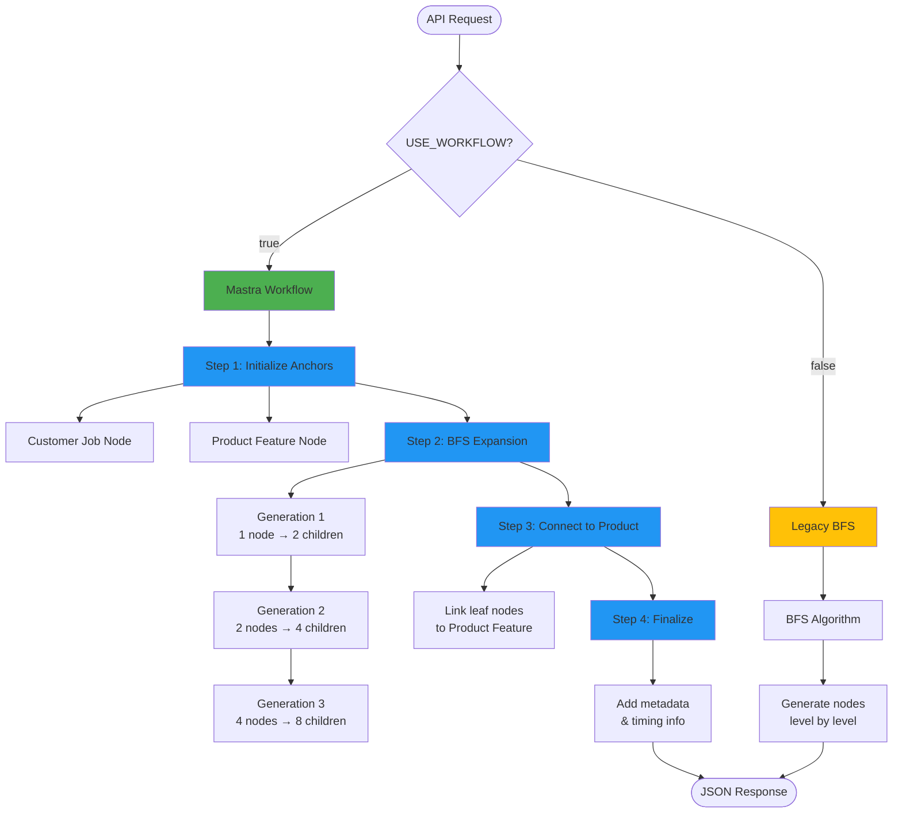

# Knowledge Dreamer Microservice

A TypeScript-based microservice that autonomously expands knowledge graphs using AI to explore connections between customers and products.

## Architecture

The Knowledge Dreamer now supports two implementations:

### 🆕 Mastra Workflow (Recommended)
A structured, observable workflow using [Mastra](https://mastra.ai) for better maintainability and debugging.

### 🔧 Legacy BFS
The original breadth-first search implementation.

## Workflow Architecture



### Workflow Steps

**Step 1: Initialize Anchors**
- Creates "Customer Job" and "Product Feature" anchor nodes
- Sets up the graph foundation

**Step 2: BFS Expansion**
- Iteratively generates child nodes using LLM
- Each generation: parent nodes → N children per parent
- Default: 2 children × 3 generations = 14 nodes (+ 2 anchors)

**Step 3: Connect to Product**
- Identifies leaf nodes (nodes with no children)
- Creates edges from leaves to "Product Feature" anchor
- Completes the customer→product journey

**Step 4: Finalize**
- Adds metadata (node count, generation time, etc.)
- Returns complete knowledge graph

## Quick Start

### 1. Install Dependencies

```bash
pnpm install
```

### 2. Configure API Key

**Important**: The API key is no longer hardcoded for security reasons.

Create a `.env` file in the project root:

```bash
cp .env.example .env
```

Edit `.env` and add your Gemini API key:

```bash
GEMINI_API_KEY=your-api-key-here
```

Get your API key from [Google AI Studio](https://makersuite.google.com/app/apikey)

### 3. Start the Service

**Using Mastra Workflow (Recommended):**

```bash
USE_WORKFLOW=true pnpm dreamer
```

**Using Legacy BFS:**

```bash
pnpm dreamer
```

The service will start on `http://localhost:3457`

**Note**: The `.env` file is gitignored and will never be committed to your repository.

### Why Use Mastra Workflow?

✅ **Better Observability**: Each step logs its progress
✅ **Easier Debugging**: Clear separation of concerns
✅ **Type Safety**: Validated inputs/outputs with Zod schemas
✅ **Maintainability**: Structured workflow vs monolithic function
✅ **Future-Ready**: Easy to add features like suspend/resume, streaming, etc.

## API Usage

### Health Check

```bash
curl http://localhost:3457/
```

**Response:**
```json
{
  "status": "ok",
  "service": "Knowledge Dreamer Microservice",
  "version": "1.0.0"
}
```

### Generate Knowledge Graph

**Endpoint:** `POST /api/v1/dream`

**Basic Example:**

```bash
curl -X POST http://localhost:3457/api/v1/dream \
  -H "Content-Type: application/json" \
  -d '{
    "customer": "Pearls of Wisdom, a company that generates synthetic data sets for training AI models.",
    "product": "Weights and Biases Weave, featuring a UI for feedback and model evaluation."
  }'
```

**With Custom Parameters:**

```bash
curl -X POST http://localhost:3457/api/v1/dream \
  -H "Content-Type: application/json" \
  -d '{
    "customer": "Pearls of Wisdom, a company that generates synthetic data sets for training AI models.",
    "product": "Weights and Biases Weave, featuring a UI for feedback and model evaluation.",
    "children_count": 3,
    "generations_count_int": 4
  }'
```

**Pretty-printed Output:**

```bash
curl -X POST http://localhost:3457/api/v1/dream \
  -H "Content-Type: application/json" \
  -d '{
    "customer": "Acme Corp, a B2B SaaS company providing project management tools.",
    "product": "Slack, a team communication platform.",
    "children_count": 2,
    "generations_count_int": 2
  }' | jq '.'
```

## Request Parameters

| Parameter | Type | Required | Default | Description |
|-----------|------|----------|---------|-------------|
| `customer` | string | Yes | - | Description of the customer/company to analyze |
| `product` | string | Yes | - | Description of the product to explore towards |
| `children_count` | number | No | 2 | Number of child nodes to generate per parent |
| `generations_count_int` | number | No | 3 | Number of expansion levels (depth) |

## Response Format

The API returns an array of nodes representing the knowledge graph:

```json
[
  {
    "id": "root",
    "content": "Customer description...",
    "edge": [
      {
        "target_id": "child-node-id-1",
        "relationship": "creates challenge of",
        "rationale": "Explanation of why this connection exists..."
      }
    ]
  },
  {
    "id": "child-node-id-1",
    "content": "Atomic fact about the customer...",
    "edge": [
      {
        "target_id": "grandchild-node-id-1",
        "relationship": "addressed by",
        "rationale": "How this progresses toward the product..."
      }
    ]
  }
]
```

## Example Use Cases

### 1. SaaS Product Exploration

```bash
curl -X POST http://localhost:3457/api/v1/dream \
  -H "Content-Type: application/json" \
  -d '{
    "customer": "TechStart Inc, a startup building collaboration tools for remote teams.",
    "product": "Notion, an all-in-one workspace.",
    "children_count": 2,
    "generations_count_int": 3
  }'
```

### 2. E-commerce Analysis

```bash
curl -X POST http://localhost:3457/api/v1/dream \
  -H "Content-Type: application/json" \
  -d '{
    "customer": "FashionHub, an online clothing retailer targeting Gen Z consumers.",
    "product": "Shopify, an e-commerce platform with social commerce features.",
    "children_count": 3,
    "generations_count_int": 2
  }'
```

### 3. Deep Technical Exploration

```bash
curl -X POST http://localhost:3457/api/v1/dream \
  -H "Content-Type: application/json" \
  -d '{
    "customer": "DataFlow Systems, building real-time data pipelines for financial services.",
    "product": "Apache Kafka with ksqlDB for stream processing.",
    "children_count": 2,
    "generations_count_int": 4
  }'
```

### 4. Save Output to File

```bash
curl -X POST http://localhost:3457/api/v1/dream \
  -H "Content-Type: application/json" \
  -d '{
    "customer": "HealthTech Co, developing patient monitoring systems.",
    "product": "AWS IoT Core for device connectivity.",
    "children_count": 2,
    "generations_count_int": 3
  }' > knowledge-graph.json
```

## Visualizing Knowledge Graphs

### Quick Visualization Generation

The simplest way to visualize your knowledge graph:

```bash
# Takes a JSON file, outputs PNG, SVG, and Mermaid diagram
npx tsx scripts/graph-to-png.ts knowledge-graph.json
# Output: knowledge-graph.png, knowledge-graph.svg, knowledge-graph.mmd
```

**Complete workflow example:**

```bash
# 1. Generate knowledge graph
curl -X POST http://localhost:3457/api/v1/dream \
  -H "Content-Type: application/json" \
  -d '{
    "customer": "Coffee shop looking to expand",
    "product": "Square POS system",
    "children_count": 2,
    "generations_count_int": 3
  }' > my-graph.json

# 2. Generate visualizations (automatically creates .png, .svg, and .mmd)
npx tsx scripts/graph-to-png.ts my-graph.json
```

**Output formats:**
- **PNG** - Raster image for presentations and documents
- **SVG** - Vector graphic for web and scalable display
- **MMD** - Mermaid source for editing and customization

**Diagram Features:**
- **Blue nodes**: Customer Job (starting anchor)
- **Green nodes**: Product Feature (ending anchor)
- **Gray nodes**: Intermediate dream nodes
- **Labeled edges**: Show relationships between concepts

### Advanced: Separate Steps

If you need more control, you can generate Mermaid and PNG separately:

```bash
# Step 1: Generate Mermaid diagram
npx tsx scripts/graph-to-mermaid.ts knowledge-graph.json knowledge-graph.mmd

# Step 2: Generate PNG from Mermaid
npx -p @mermaid-js/mermaid-cli mmdc -i knowledge-graph.mmd -o knowledge-graph.png
```

## Understanding the Output

### Node Structure

- **id**: Unique identifier (sanitized descriptive name + UUID)
- **content**: Atomic, verifiable fact about the topic
- **edge**: Array of connections to child nodes

### Edge Structure

- **target_id**: ID of the connected child node
- **relationship**: Type of connection (e.g., "relies on", "creates challenge of")
- **rationale**: Explanation of why this connection exists and how it progresses toward the product

### Graph Traversal

The root node represents the customer. Each generation explores concepts that:
1. Are exploratory (not just attributes)
2. Are factually accurate and verifiable
3. Progress toward the product domain
4. Build deeper understanding of product-market fit

## Performance

- **Typical completion time**: 5-10 seconds for 2 children × 3 generations
- **Node count**: `1 + (children_count × generations_count_int × avg_branching)`
- **Example**: 2 children, 3 generations = ~7-15 nodes

## Troubleshooting

### Service won't start

```bash
# Check if port 3457 is in use
lsof -i :3457

# Kill existing process if needed
kill -9 <PID>
```

### Request fails

```bash
# Verify service is running
curl http://localhost:3457/

# Check logs in terminal where service is running
```

### Empty or unexpected results

- Ensure customer and product descriptions are detailed
- Try adjusting `children_count` and `generations_count_int`
- Check server logs for LLM errors

## Advanced Usage

### Batch Processing

```bash
# Create multiple requests
for customer in "CompanyA" "CompanyB" "CompanyC"; do
  curl -X POST http://localhost:3457/api/v1/dream \
    -H "Content-Type: application/json" \
    -d "{
      \"customer\": \"$customer, description here\",
      \"product\": \"Target product\",
      \"children_count\": 2,
      \"generations_count_int\": 2
    }" > "graph-$customer.json"
done
```

### Integration with jq

```bash
# Extract all node IDs
curl -s -X POST http://localhost:3457/api/v1/dream \
  -H "Content-Type: application/json" \
  -d '{"customer": "...", "product": "..."}' \
  | jq -r '.[].id'

# Count total nodes
curl -s -X POST http://localhost:3457/api/v1/dream \
  -H "Content-Type: application/json" \
  -d '{"customer": "...", "product": "..."}' \
  | jq 'length'

# Extract all relationships
curl -s -X POST http://localhost:3457/api/v1/dream \
  -H "Content-Type: application/json" \
  -d '{"customer": "...", "product": "..."}' \
  | jq -r '.[] | .edge[] | .relationship' | sort | uniq
```

## Project Structure

```
mastra/
├── src/
│   └── dreamer/
│       ├── types.ts              # Data structures and interfaces
│       ├── llm-service.ts        # Gemini AI integration
│       ├── dreamer-service.ts    # Legacy BFS expansion algorithm
│       ├── dream-workflow.ts     # 🆕 Mastra workflow implementation
│       ├── mastra-instance.ts    # 🆕 Mastra configuration
│       ├── server.ts             # Hono API server (supports both implementations)
│       └── README.md             # Detailed technical docs
└── README.md                     # This file
```

### Implementation Comparison

| Feature | Mastra Workflow | Legacy BFS |
|---------|----------------|------------|
| **Observability** | ✅ Step-by-step logs | ⚠️ Monolithic logs |
| **Type Safety** | ✅ Zod schemas | ⚠️ TypeScript only |
| **Maintainability** | ✅ Modular steps | ⚠️ Single function |
| **Debugging** | ✅ Clear step boundaries | ⚠️ Stack traces |
| **Performance** | ~10s for 2×3 graph | ~10s for 2×3 graph |
| **Output** | ✅ Same format | ✅ Same format |

## AI Configuration

### Using Google Gemini (Default)

The service is configured to use **Google Gemini 2.5 Flash-Lite** model by default - optimized for cost-efficiency and high throughput with 1M+ token context window.

#### API Key Setup

**Secure Configuration**: The API key is loaded from environment variables for security.

**Method 1: Using .env file (Recommended)**

1. Copy the example file:
   ```bash
   cp .env.example .env
   ```

2. Edit `.env` and add your key:
   ```bash
   GEMINI_API_KEY=your-api-key-here
   ```

3. Start the service (it will automatically load from .env):
   ```bash
   pnpm dreamer
   ```

**Method 2: Using environment variable**

```bash
export GEMINI_API_KEY="your-api-key-here"
pnpm dreamer
```

**Method 3: Inline**

```bash
GEMINI_API_KEY="your-api-key-here" pnpm dreamer
```

#### Get a Gemini API Key

1. Visit [Google AI Studio](https://makersuite.google.com/app/apikey)
2. Sign in with your Google account
3. Click "Create API Key"
4. Copy your key and add it to your `.env` file

**Security Note**: The `.env` file is automatically gitignored and will never be committed to your repository.

## Configuration

### Port Configuration

To change the port, edit `src/dreamer/server.ts`:

```typescript
const port = 3457; // Change to your desired port
```

## What's Next?

This microservice is designed to be part of a larger Code Dreamer system:

1. **Email Generator**: Use the knowledge graph to create personalized sales emails
2. **Fact Verification**: Add web search to verify generated facts
3. **Graph Visualization**: Build UI to explore the knowledge graph
4. **Feedback Loop**: Implement reinforcement learning based on email performance

## License

See LICENSE file in project root.
